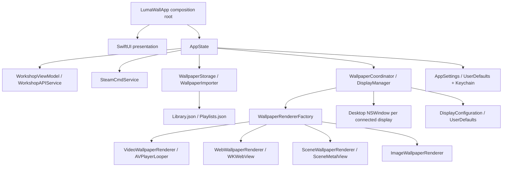

# Architecture

LumaWall is a native SwiftUI/AppKit application built from application, service,
persistence, and rendering boundaries. It has no third-party linked or package
dependencies; authenticated Workshop downloads invoke the separately installed SteamCMD.

## Application and presentation

`LumaWallApp` creates one `AppState` and injects its coordinator, settings, Workshop view
model, and Steam service into `ApplicationRootView`. `ApplicationRootView` owns the native
`NavigationSplitView`; the main destinations are implemented by `DiscoverView`,
`LibraryView`, `PlaylistsView`, `DisplaysView`, and `ProductSettingsView`. Presentation
types issue commands through `AppState` or the focused coordinator/service and do not
construct renderers or execute shell commands.

## Domain and persistence

`Models.swift` defines the shared `WallpaperItem`, `WallpaperType`, `WallpaperSource`,
`CompatibilityStatus`, `PlaybackConfiguration`, `DisplayConfiguration`, `WorkshopItem`,
`WallpaperDownload`, and `WallpaperPlaylist` types. Existing `wallpaper.library.v1`
metadata is decoded with defaults for new fields and migrated idempotently into
`Library.json`. Playlists are stored separately in `Playlists.json`. Display assignments,
favorited Workshop IDs, and lightweight settings remain in `UserDefaults`; the Steam Web
API key lives in Keychain.

`WallpaperStorage` owns the Application Support tree and is the only component allowed to
delete wallpaper content. It confines deletion to `Wallpapers/<UUID>`. New local imports
and Steam downloads are staged, validated, and installed into that directory. ZIP paths,
symlinks, declared expansion sizes, file counts, and post-extraction sizes are checked.
Managed install/replacement/removal operations are serialized across import sources.

## Workshop and Steam

`WorkshopAPIService` calls Valve's documented
[`IPublishedFileService/QueryFiles/v1`](https://partner.steamgames.com/doc/webapi/IPublishedFileService)
endpoint
with app ID `431960`, maps only returned metadata, resolves public creator names when
available, and paginates with Steam cursors. It uses an ephemeral session without a URL
cache because Valve requires the API key in the request URL. `WorkshopViewModel` owns the
query state.

`SteamCmdService` serializes downloads through explicit states. It locates a custom,
Homebrew, or `PATH` SteamCMD executable and launches it directly with `Process`; no shell
is involved. The account name and app-owned install directory are quoted and sent as
SteamCMD commands. Password and Steam Guard challenges are delivered through standard
input and are held only long enough to write the response. A successful Workshop command
must be observed before a downloaded directory is validated and passed to
`WallpaperStorage`.

## Rendering and desktop integration

`WallpaperRenderer` defines a shared lifecycle and `RendererCapabilities` describes
feature differences. `WallpaperRendererFactory` dispatches from the decoded project type:

- Video creates an independent `AVQueuePlayer` and `AVPlayerLooper` per display.
- Web creates a nonpersistent `WKWebView` with local-project read access, autoplay, and
  blocked non-file navigation. `WebWallpaperExtension` is the empty versioned extension
  point for future user-property support; no partial Wallpaper Engine API is injected.
- Scene preserves `ScenePackage`, `WETexture`, and `SceneMetalView`. Compatible textures
  are prepared once and shared by active display views. Unsupported preparation falls
  back to a project preview and updates persisted compatibility state.
- Unsupported project types fail explicitly.

`WallpaperCoordinator` owns renderer sessions and desktop windows. `DisplayManager` derives
a stable identity from `CGDisplayCreateUUIDFromDisplayID`, not array order. Each enabled
display has its own renderer and playback configuration. The existing desktop placement
uses a borderless, mouse-ignoring `NSWindow` at `desktopWindow + 1` with
`.canJoinAllSpaces`, `.stationary`, `.ignoresCycle`, and `.fullScreenAuxiliary`. These are
public APIs; no private SkyLight/CGS APIs are used.

The coordinator responds to display reconfiguration, display/system sleep, session
lock/unlock, active-Space changes, foreground-app activation, Low Power Mode, and app
termination. Paused Video and Scene renderers stop their normal decode/draw loops. WebKit
media is suspended and the renderer requests an inline CSS-animation pause, while arbitrary
WebGL `requestAnimationFrame` work and overriding stylesheet rules remain documented limits.

See `IMPLEMENTATION_STATUS.md` for validation results and remaining integration work.
