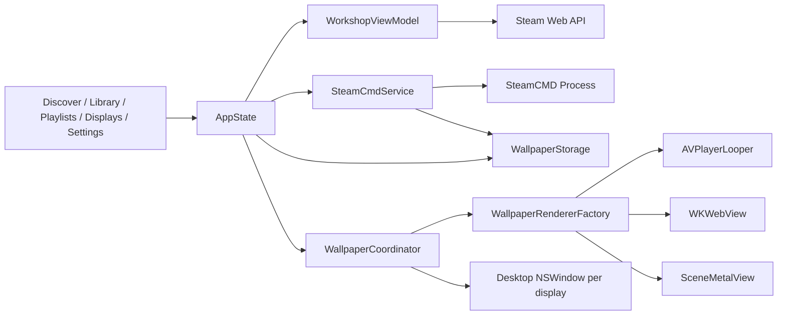

# Implementation status

Status date: 2026-09-14. Baseline audit revision: `80c40364d79e2394006cbeffb901c4c522a692fb`.
The baseline is documented in `REPO_ANALYSIS.md`; this document describes the working tree
after the first product implementation pass.

## Architecture after these changes

The application remains a native SwiftUI/AppKit program with no third-party linked or
package dependencies. Workshop downloads use a separately installed SteamCMD executable.
The code now has explicit boundaries even though the repository retains its simple flat
`Sources` directory:

| Layer | Current types |
|---|---|
| Application | `LumaWallApp`, `AppState`, `AppSection` |
| Presentation | `ApplicationRootView`, `DiscoverView`, `LibraryView`, `PlaylistsView`, `DisplaysView`, `ProductSettingsView` |
| Domain | `WallpaperItem`, `WallpaperType`, `WallpaperSource`, `CompatibilityStatus`, `WorkshopItem`, `WallpaperDownload`, `WallpaperPlaylist`, `DisplayConfiguration`, `PlaybackConfiguration` |
| Services | `WorkshopAPIService`, `WorkshopViewModel`, `SteamCmdService`, `SteamCMDLocator`, `WallpaperImporter` |
| Rendering | `WallpaperCoordinator`, `WallpaperRenderer`, `WallpaperRendererFactory`, `VideoWallpaperRenderer`, `WebWallpaperRenderer`, `SceneWallpaperRenderer`, `ImageWallpaperRenderer`, `SceneResources` |
| Persistence | `WallpaperStorage`, JSON library/playlist files, `AppSettings`, `UserDefaults`, `KeychainStore` |



`AppState` coordinates product actions and persistence but does not own renderer details,
network request construction, Steam process parsing, or filesystem installation. The
renderer protocol exposes lifecycle calls plus explicit capabilities. Scene parsing and
Metal rendering remain in their existing low-level types.

## Completed features

- A native, selectable `NavigationSplitView` with Discover, Library, Playlists, Displays,
  and Settings.
- Public Workshop browsing through Valve's documented
  [`IPublishedFileService/QueryFiles/v1`](https://partner.steamgames.com/doc/webapi/IPublishedFileService)
  for Wallpaper
  Engine app ID `431960`, including search, type and discovered-tag filters, local content
  descriptor filtering, four documented sort modes, cursor pagination, public creator
  names, preview images, descriptions, sizes, dates, subscription counts, and IDs.
- A real Workshop detail view with compatibility, metadata, download state, progress,
  retry/cancel, downloaded preview, removal, display selection, and Apply.
- Automatic SteamCMD discovery for common Apple Silicon/Intel Homebrew and `PATH`
  installations, plus a custom executable picker.
- A serialized SteamCMD task pipeline with queued, authenticating, password, Steam Guard,
  downloading, validating, importing, completed, failed, and cancelled states.
- Cancellation is available through the queued/authentication/download phases. It closes
  once validated managed installation begins, which is intentionally allowed to finish.
- Credential responses are written to the running process over stdin. Passwords and Steam
  Guard codes are never put in process arguments, `UserDefaults`, Keychain, model files,
  status text, or logs.
- A managed Application Support library for project folders, ZIPs, scene packages, and
  MP4/MOV/M4V files. Workshop IDs are preserved from metadata, `project.json`, or the
  standard Steam Workshop path. Local IDs are deterministic for repeat imports.
- Managed install, replacement, and deletion mutations are serialized so simultaneous
  local and Workshop imports cannot race over the same destination.
- Idempotent migration of the old `wallpaper.library.v1` metadata. Existing external files
  remain in place until the user explicitly reimports them; migration does not delete data.
- Searchable/filterable grid and list Library views, local favorites independent of Steam
  subscription or download state, recent-played dates, live renderer previews, Show in
  Finder, playlist actions, and managed-file-aware removal confirmations.
- Persisted playlist create, rename, delete, add, remove, reorder, sequential/shuffle mode,
  and interval playback.
- Stable display identity using `CGDisplayCreateUUIDFromDisplayID`, persisted assignment
  and playback settings, separate wallpapers per connected display, enable/disable,
  fill/fit, mute, volume, reconnect restoration, and legacy global assignment migration.
- Changes to the shared volume, scaling, and playback-rate controls are applied to active
  and persisted display configurations immediately; per-display controls can then override
  the shared values.
- Shared renderer lifecycle (`play`, `pause`, `stop`, configuration, and resize) with
  capability flags and explicit unsupported dispatch.
- Video playback through an independent `AVQueuePlayer`/`AVPlayerLooper` for each display,
  with MP4/MOV/M4V validation, seamless looping, scaling, mute, volume, playback rate,
  resolution preference, pause/resume, and playback-failure propagation.
- Local Web wallpaper playback through a nonpersistent `WKWebView`, with JavaScript,
  WebGL, project-root file access, media autoplay, preview mouse input, desktop mouse
  passthrough, media/CSS lifecycle controls, and blocked non-file navigation.
- `WebWallpaperExtension` is an intentionally empty extension point for a future versioned
  Wallpaper Engine web/property bridge. No partial compatibility API is injected.
- Existing Scene PKG/TEX/Metal code is preserved. Compatibility is reported as full,
  partial, preview fallback, or unsupported. Runtime scene preparation failures update the
  stored compatibility result when a preview fallback is available.
- Event-driven pause/resume for screen sleep, system sleep, lock/unlock, Low Power Mode,
  and foreground full-screen applications. No periodic full-screen poll was added.
- A compact menu with Pause/Resume All, Stop All, recent wallpapers, displays, import,
  application/settings navigation, and quit.
- Structured `Logger` categories for app, library, Workshop, Steam, renderer, video, Web,
  Scene, display, and storage behavior.

## Persistence and storage

The default root is:

```text
~/Library/Application Support/local.lumawall.app/
├── Library.json
├── Playlists.json
├── Wallpapers/<stable UUID>/
├── Preview Cache/
├── Staging/
└── SteamCMD/
```

`Library.json` holds wallpaper metadata, downloaded-item favorites, compatibility, size,
and recent dates. `Playlists.json` holds references to Library UUIDs. Per-display
configuration, favorited Workshop IDs, and ordinary settings use `UserDefaults`. The Steam
Web API key uses a generic-password Keychain item
with after-first-unlock, this-device-only accessibility. The Steam account name and custom
SteamCMD path are treated as non-sensitive setup values and stored in `UserDefaults`.

Only `WallpaperStorage.removeManagedContent(for:)` deletes wallpaper content. It verifies
the exact expected `Wallpapers/<item UUID>` directory before removal. Removing an old
external Library entry never deletes its source file or folder.

## Security work

- PKGV package size, entry count, offsets, lengths, paths, duplicate paths, and extraction
  destination symlinks are checked.
- TEX dimensions, encoded/decoded sizes, multiplication overflow, pixel count, compression,
  and Metal upload byte count are checked. TEX input is capped at 384 MB, each decoded
  texture at 256 MB, and each prepared Scene at 512 MB of combined decoded texture data.
  The baseline out-of-bounds raw texture upload risk is fixed.
- JSON project and scene resources have 8 MB limits; packages have a 2 GB mapped-data
  limit. Individual decoded textures are capped at 256 MB and each prepared Scene is
  capped at 512 MB of combined decoded texture payload.
- ZIP input is capped at 4 GB. Paths, traversal components, symlinks, entry count, declared
  expanded bytes, available disk capacity, and the extracted tree are checked. The
  installed tree is capped at 100,000 entries and 20 GB; non-regular filesystem objects
  are rejected before copy.
- Local preview files are checked for encoded size, dimensions, pixel count, and a readable
  ImageIO source before they are decoded or advertised as a Scene fallback.
- `SteamCmdService` uses `Process.executableURL` and an argument array. It never invokes a
  shell. Workshop IDs must be decimal and Steam command strings reject newlines/NULs.
- A current-command success marker is required before an existing Workshop directory can
  be accepted, preventing stale content from turning a failed download into success.
- The Web API key is not logged. Steam credential prompts are not logged or retained.
- Workshop requests use an ephemeral `URLSession` with its URL cache disabled, avoiding a
  shared response-cache entry whose request URL contains the API key required by Valve.
- WebKit file reads are confined to the canonical project root. Any file, HTTP, HTTPS, or
  custom-scheme navigation outside that root is cancelled. Normal subresource/fetch
  networking remains possible and is disclosed to users.
- No Steam ownership, authentication, Steam Guard, or Workshop permission bypass exists.
- No private macOS APIs were added or found. Desktop placement still uses the public
  `CGWindowLevelForKey(.desktopWindow)` and AppKit window APIs.

The audited repository contains an MIT license, not a GPL notice. The existing `LICENSE`
file and attribution remain unchanged.

## Partially completed or integration-dependent features

| Area | Current status |
|---|---|
| Live Workshop query | Implemented against Valve's documented API; requires a user API key and was not exercised with a real key in this session. |
| Authenticated Steam download | Full local state/process/import path is implemented and command construction is tested; an ownership-bearing Steam account and Steam Guard were not available for an end-to-end run. |
| SteamCMD bootstrap | The locator prefers Valve’s macOS `steamcmd.sh` wrapper (including `~/Steam`) and reports captive-portal/update failures. The updater and authenticated Workshop access were verified successfully over an unrestricted mobile connection. |
| Content rating | Uses content descriptor IDs actually returned by Steam and searches forward through sparse pages. Descriptor labels are not invented. Results depend on Steam returning those IDs. |
| Desktop integration | Preserves the baseline window mechanism and adds lifecycle coordination. App startup was smoke-tested, but Spaces, Mission Control, full-screen apps, and physical hot-plug need a manual matrix on multiple macOS releases. |
| Video | Lifecycle and AVFoundation construction compile and baseline video behavior is preserved; codec/hardware combinations need representative-media testing. |
| Web | Local loading, WebGL-capable WebKit, autoplay, navigation policy, and lifecycle code are implemented; compatibility needs representative Workshop projects. |
| Preview cache | Local decoded images use an in-memory `NSCache` and remote images use the system URL cache. The app-owned on-disk Preview Cache directory is prepared/clearable but is not yet populated by a thumbnail generator. |
| Full-screen pause | Public, event-driven `CGWindowListCopyWindowInfo` detection runs on app activation and active-Space changes. An app changing to a borderless full-screen window without either event may be missed. |
| Battery behavior | Renderers pause for event-driven Low Power Mode when enabled. There is no separate pause-on-any-battery-power policy yet. |
| Download durability | Downloads queue correctly within one run. Pending/running task state and partial progress are not restored after application relaunch. SteamCMD's own downloaded files remain available for validation/retry. |
| Playlist runtime | Playlist definitions persist; the currently running playlist, position, and chosen target display do not resume after relaunch. |
| Storage location | The managed path is visible and openable. Moving it to a custom volume, with transactional migration, is not implemented. |

## Unsupported features

- Wallpaper Engine application wallpapers and Windows executables.
- WebM as an advertised format; this build does not assume AVFoundation can decode it.
- Steam subscribe/unsubscribe behavior. Favorites are deliberately local and downloads use
  the legitimate SteamCMD Workshop command.
- A Wallpaper Engine-compatible Web user-property API, audio visualizer API, or scripting
  bridge. The extension boundary exists, but compatibility is not claimed.
- Complete Scene compatibility, including DXT-compressed textures, multiple composited
  layers, general particle systems, puppet rigs, animated sprites, timeline animation,
  camera/parallax behavior, audio-reactive scripts, SceneScript, and custom shaders.
- Separate renderer processes. No observed repository failure justified that complexity in
  this pass.

## Scene compatibility

`SceneCompatibilityAnalyzer` opens `scene.json`, requires an image object and compatible
base material/TEX data, and records major unsupported structures. `SceneResources` then
uses the existing implementation: the first image object becomes a full-screen base,
up to three effect passes are mapped to its wave approximation, compatible masks are
loaded, and generic fog/ember effects are inferred from recognized resource names.

This is explicitly marked **Partially supported**. If the base texture cannot be decoded
and a project preview exists, the item is marked **Preview fallback**. Without a usable
base or preview it is **Unsupported**, and Apply is disabled. A later mask/pipeline failure
also falls back and updates persisted compatibility rather than silently claiming success.

Scene resources are prepared away from the main actor and shared by active per-display
views, avoiding one package/TEX decode and GPU texture allocation per monitor. Each
`SceneMetalView` remains capped at 30 FPS and actually pauses its display loop.

## Performance concerns

- Each enabled display intentionally owns a renderer/window. Video decoder cost therefore
  scales with display count; independent players are required for reliable per-display
  lifecycle/configuration.
- Active Scene views share immutable GPU textures, but each view has a command queue and
  draw loop. Complex future Scene support will need profiling before adding layers/effects.
- Preview renderers stop and release AVPlayer/WebKit/Metal view resources when dismissed.
  Cancelling a large Scene preview cannot interrupt all synchronous parser work already
  running inside its detached preparation task.
- WebKit media and CSS animations pause. Arbitrary JavaScript/WebGL animation loops cannot
  be fully suspended through public WebKit APIs and may continue consuming resources;
  stylesheet rules can also override the best-effort inline animation pause.
- Workshop calls are asynchronous and paginated. Local import, archive work, project copy,
  Scene preparation, and Steam installation run outside the main actor. Small JSON metadata
  reads/writes still occur synchronously.
- The local artwork cache is bounded by `NSCache` eviction policy. No unbounded renderer
  cache remains; prepared resources are retained only for active wallpaper IDs.

## Known bugs and practical limits

- SteamCMD output parsing currently recognizes common English prompts/status lines. Valve
  output changes or localized output may require additional patterns.
- SteamCMD itself may retain its normal machine-authentication state inside the app-owned
  SteamCMD data directory. LumaWall does not parse or copy that state and never stores the
  submitted password/Guard response.
- Web wallpapers can make network fetches even though top-level navigation is blocked.
  A per-project network permission model is future work.
- Library and playlist JSON writes are atomic but small and synchronous; very large
  libraries may justify a persistence actor/database later.
- Managed-directory replacement and metadata persistence recover from ordinary thrown
  errors, but they are not one crash-atomic transaction. A process crash at a rename/save
  boundary can leave a recoverable backup or orphan under `Staging`/`Wallpapers`; startup
  reconciliation is not implemented yet.
- `LSUIElement` keeps the app out of the Dock. Distribution behavior for Launch at Login
  cannot be certified until the bundle has a stable Developer ID signature.
- The shell build creates a thin binary for the host architecture. There is no Xcode
  project, archive scheme, universal build, Hardened Runtime, notarization, or release
  signing configuration.
- MP4/MOV/M4V imports validate their location and extension first; actual AVFoundation
  playability is checked asynchronously when the renderer prepares, so an extension-valid
  but corrupt video can enter the Library and then report a playback error.

## Build and test results

Environment used for this pass: Apple Silicon (`arm64`), macOS 26.6.2, Apple Swift 6.3.3,
and the macOS 26.5 SDK. Deployment target remains macOS 14.0.

Commands:

```sh
Scripts/run_tests.sh
Scripts/build_app.sh
```

Both commands pass. The app output is `build/LumaWall.app`, is ad-hoc signed by the existing
script, and was launched once with `open build/LumaWall.app`; it reached a live application
and responded to a normal Apple-event quit without creating a recent crash report.

All production sources also pass `swiftc -typecheck` with
`-strict-concurrency=complete -warn-concurrency -warnings-as-errors` using the same target
and linked Apple frameworks. The three repository diagnostic tools also compile against
the updated PKG, TEX, and Scene types.

The executable test suite covers:

- stable IDs and backward-compatible model decoding;
- Workshop-favorite ID persistence and validation;
- video, Web, unsupported application, Workshop-folder, unsafe project, and unsafe or
  unusable preview detection;
- Workshop ID/tag preservation and project-root confinement;
- PKGV directory/payload, duplicate, traversal, and destination-symlink handling;
- undersized/oversized TEX data;
- managed copy, repeat import, external deletion protection, JSON/favorite/recent/playlist
  persistence, safe ZIP import, stable ZIP identity, and ambiguous archive rejection;
- Workshop JSON/type/content/cursor mapping and official query enum values;
- Steam command quoting, app ID/validation command, credential exclusion, newline rejection,
  progress parsing, and the managed-install cancellation boundary.

There are no rendering snapshots or desktop-window UI tests. No live network, Steam
credential, copyrighted Workshop asset, or API secret was added to the repository.

`xcodebuild` remains inapplicable because this repository has no `.xcodeproj`, workspace,
or Swift package. The existing direct `swiftc` build pipeline was preserved rather than
inventing signing configuration during the feature pass.

## Next recommended engineering tasks

1. Run a controlled integration matrix with a real Steam Web API key, a legitimate
   Wallpaper Engine-owning test account, password and both Steam Guard variants, failure
   cases, cancellation, and several public Video/Web/Scene items. Add sanitized output
   fixtures for every observed SteamCMD status format.
2. Test desktop windows on Sonoma and current macOS across multiple Spaces, Mission
   Control, full-screen apps, display sleep, lock/unlock, clamshell changes, monitor
   hot-plug, resolution/scaling changes, and mixed-refresh displays.
3. Add an Xcode project with app/unit-test targets, universal architecture validation,
   release entitlements, Hardened Runtime, Developer ID signing, notarization, and an
   explicit decision about App Sandbox compatibility. Preserve the current scripts for CI
   until the new pipeline is proven.
4. Add dependency-injected URL protocol and fake-executable integration tests for complete
   Workshop pagination, cancellation races, authentication prompts, process termination,
   and import rollback.
5. Add representative, redistributable Video and Web fixtures. Measure decoder, WebKit,
   GPU, memory, and energy behavior per display; decide on a documented Web network policy
   and implement a complete versioned property bridge only against verified behavior.
6. Improve Scene compatibility incrementally: DXT decode first, then correct multi-layer
   positioning/blending/tint, animation timelines, and selected particle/effect families.
   Keep compatibility reporting tied to actual renderer support.
7. Add generated on-disk video/Web thumbnails, cache accounting, durable download recovery,
   and transactional custom-storage migration.
