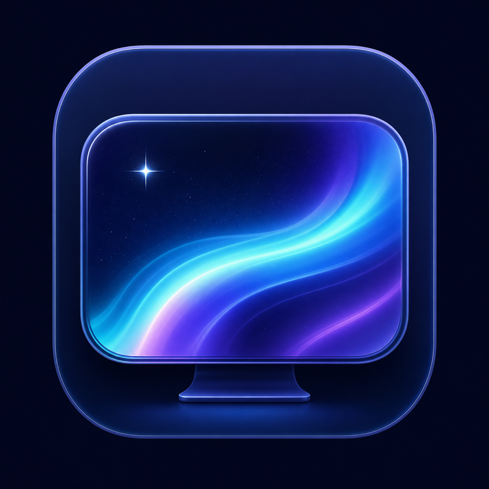

<div align="center">
  
  <h1>LumaWall</h1>
  <p>A native macOS library and player for compatible Wallpaper Engine projects.</p>

  [](https://support.apple.com/macos)
  [](https://www.swift.org/)
  [](https://github.com/jk2005-alt/LumaWall/actions/workflows/ci.yml)
  [](LICENSE)
</div>

LumaWall browses public Wallpaper Engine Workshop metadata, downloads projects through
a legitimate SteamCMD sign-in, manages local wallpaper files, and renders compatible
content behind the macOS desktop icons. It uses only native Apple frameworks and does
not bundle Wine, Electron, or a Windows runtime.

## Highlights

- Native Discover, Library, Playlists, Displays, and Settings sections
- Workshop search, type/tag/content filters, sorting, details, and cursor pagination
- Legitimate SteamCMD authentication, Steam Guard prompts, queued downloads, and progress
- Managed import of project folders, ZIP archives, scene packages, and supported videos
- Hardware-accelerated MP4, MOV, and M4V looping with per-display playback settings
- Local HTML/CSS/JavaScript/WebGL wallpapers in an isolated `WKWebView`
- Partial native Metal rendering for compatible Wallpaper Engine image scenes
- Persistent favorites independent of downloads, recent wallpapers, playlists, and per-display assignments
- Pause and resume from the app or menu bar, including event-driven power/session handling
- Optional Launch at Login
- No analytics or third-party application frameworks; SteamCMD remains an external tool for downloads

## Compatibility

| Wallpaper type | Status |
|---|---|
| MP4, MOV, M4V | Supported |
| Wallpaper Engine video projects | Supported |
| Local web projects | Supported; see security notes below |
| `scene.pkg` image scenes | Partial, with explicit preview fallback |
| Up to three compatible wave passes | Partial approximation |
| DXT textures, multiple layers, timelines, general particles and custom shaders | Unsupported |
| Application wallpapers and Windows executables | Not executed |
| WebM | Not advertised; AVFoundation support is not assumed |

Wallpaper Engine is an evolving, proprietary format. A package importing successfully
does not imply every original effect can be reproduced yet. Compatibility reports and
clean-room format research are welcome.

## Requirements

- macOS 14 Sonoma or newer
- Apple Silicon Mac recommended (the build script targets the current Mac architecture)
- Apple Command Line Tools for building from source
- SteamCMD and a Steam account with legitimate Wallpaper Engine access for Workshop downloads
- A Steam Web API key, stored in Keychain, for in-app Workshop browsing

## Build from source

```sh
git clone https://github.com/jk2005-alt/LumaWall.git
cd LumaWall
chmod +x Scripts/build_app.sh Scripts/run_tests.sh
Scripts/run_tests.sh
Scripts/build_app.sh
open build/LumaWall.app
```

The local build is ad-hoc signed. The finished app is written to
`build/LumaWall.app`.

## Use LumaWall

1. Open **Settings** to configure a Steam Web API key and locate SteamCMD when using the Workshop.
2. Browse **Discover**, inspect an item, and download it through SteamCMD, or use **Import** for local content.
3. Open a Library item to preview it and choose a target display.
4. Manage different assignments under **Displays**, and pause or resume them from the menu bar.

New imports are copied into the managed Application Support library. Metadata from the
older path-based library is migrated without deleting or moving the original files.

## Design and privacy

Native system frameworks handle the interface, networking, video decoding, Web content,
desktop windows, Keychain access, and GPU rendering. Imported projects are treated as
untrusted data. Application projects and Windows executables are rejected. Web projects
do execute their local JavaScript in WebKit; top-level external navigation is blocked,
file read access is limited to the project root, and ordinary web resource requests can
still reach the network.

The app stores library and playlist metadata in Application Support, display assignments
and preferences in `UserDefaults`, and the Steam Web API key in Keychain. Passwords and
Steam Guard codes are never persisted or logged. See [the architecture overview](Docs/ARCHITECTURE.md)
and [implementation status](IMPLEMENTATION_STATUS.md) for details and current limits.

## Contributing

Bug reports, renderer compatibility improvements, tests, and documentation are all
welcome. Please read [CONTRIBUTING.md](CONTRIBUTING.md) and the
[community code of conduct](CODE_OF_CONDUCT.md) first. Report security issues through
GitHub private security advisories as described in [SECURITY.md](SECURITY.md).

Do not upload Workshop wallpapers or other copyrighted assets to issues or pull
requests unless their license explicitly permits redistribution.

## License

LumaWall is open-source software released under the [MIT License](LICENSE).

LumaWall is an independent project and is not affiliated with or endorsed by Valve
Corporation or the Wallpaper Engine developers. “Wallpaper Engine” is used only to
describe file-format compatibility.
