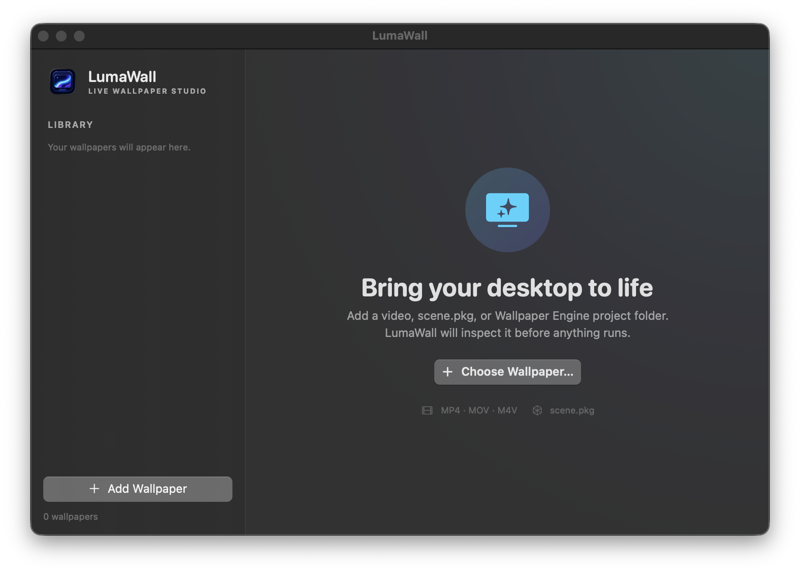

<div align="center">
  
  <h1>LumaWall</h1>
  <p>A lightweight, native live wallpaper engine for macOS.</p>

  [](https://support.apple.com/macos)
  [](https://www.swift.org/)
  [](https://github.com/jk2005-alt/LumaWall/actions/workflows/ci.yml)
  [](LICENSE)
</div>



LumaWall lives quietly in the menu bar and renders motion behind your desktop
icons. It plays ordinary videos with AVFoundation and renders compatible Wallpaper
Engine scenes directly with Metal—without Wine, Electron, or a Windows runtime.

## Highlights

- Native SwiftUI/AppKit menu-bar experience
- Hardware-accelerated MP4, MOV, and M4V looping
- Direct import of Wallpaper Engine `scene.pkg` packages
- Wallpaper Engine video and scene project-folder import
- Native image-scene rendering with masked water waves, fog, and embers
- Fill and fit modes across multiple displays
- Pause, resume, and stop controls from the menu bar
- Automatic pause during display sleep and inactive user sessions
- Optional Launch at Login
- No analytics, accounts, uploads, or third-party runtime dependencies

## Compatibility

| Wallpaper type | Status |
|---|---|
| MP4, MOV, M4V | Supported |
| Wallpaper Engine video projects | Supported |
| `scene.pkg` image scenes | Supported |
| Water-wave masks, fog, ember particles | Supported |
| Advanced SceneScript, puppet rigs, complex effects | Partial / evolving |
| Web wallpapers | Not executed |
| Application wallpapers and Windows executables | Not executed |

Wallpaper Engine is an evolving, proprietary format. A package importing successfully
does not imply every original effect can be reproduced yet. Compatibility reports and
clean-room format research are welcome.

## Requirements

- macOS 14 Sonoma or newer
- Apple Silicon Mac recommended (the build script targets the current Mac architecture)
- Apple Command Line Tools for building from source

## Build from source

```sh
git clone https://github.com/jk2005-alt/LumaWall.git
cd LumaWall
chmod +x Scripts/build_app.sh Scripts/run_tests.sh
Scripts/run_tests.sh
Scripts/build_app.sh
open build/LumaWall.app
```

The local build is ad-hoc signed. The finished app is written to
`build/LumaWall.app`.

## Use LumaWall

1. Open LumaWall and choose **Add Wallpaper**.
2. Select a video, `scene.pkg`, or Wallpaper Engine project folder. You can also
   drag it onto the library window.
3. Choose **Set as Wallpaper**.
4. Pause, resume, stop, or reopen the library from the menu-bar icon.

LumaWall references imported files in place. Keep the original file or project folder
where it was when imported.

## Design and privacy

LumaWall is intentionally small: native system frameworks handle the interface,
video decoding, desktop windows, and GPU rendering. Imported projects are treated as
untrusted data. Windows executables, web content, and project scripts are not run.

The app stores only library paths and preferences locally in `UserDefaults`. It has no
telemetry or network service. See [the architecture overview](Docs/ARCHITECTURE.md) for
the main components.

## Contributing

Bug reports, renderer compatibility improvements, tests, and documentation are all
welcome. Please read [CONTRIBUTING.md](CONTRIBUTING.md) and the
[community code of conduct](CODE_OF_CONDUCT.md) first. Report security issues through
GitHub private security advisories as described in [SECURITY.md](SECURITY.md).

Do not upload Workshop wallpapers or other copyrighted assets to issues or pull
requests unless their license explicitly permits redistribution.

## License

LumaWall is open-source software released under the [MIT License](LICENSE).

LumaWall is an independent project and is not affiliated with or endorsed by Valve
Corporation or the Wallpaper Engine developers. “Wallpaper Engine” is used only to
describe file-format compatibility.
