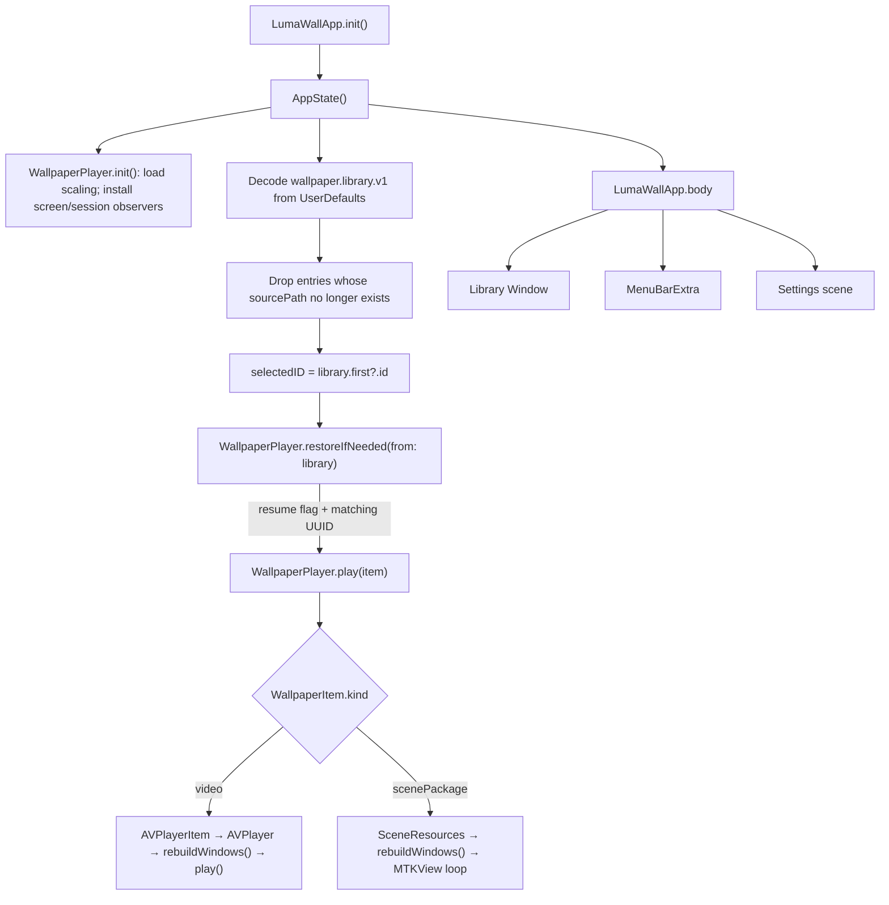
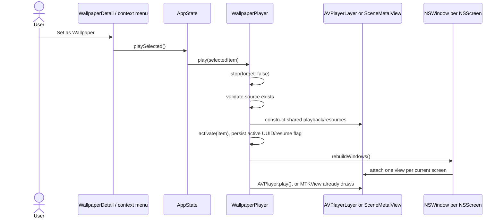
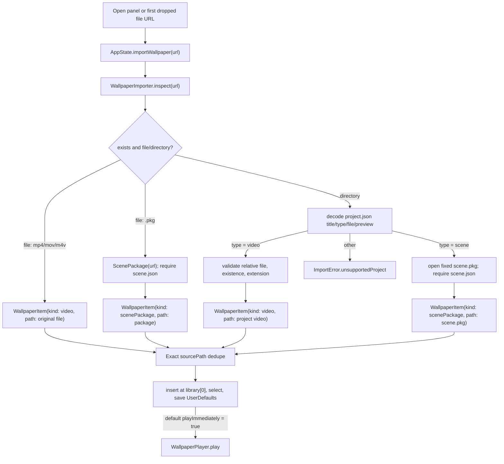
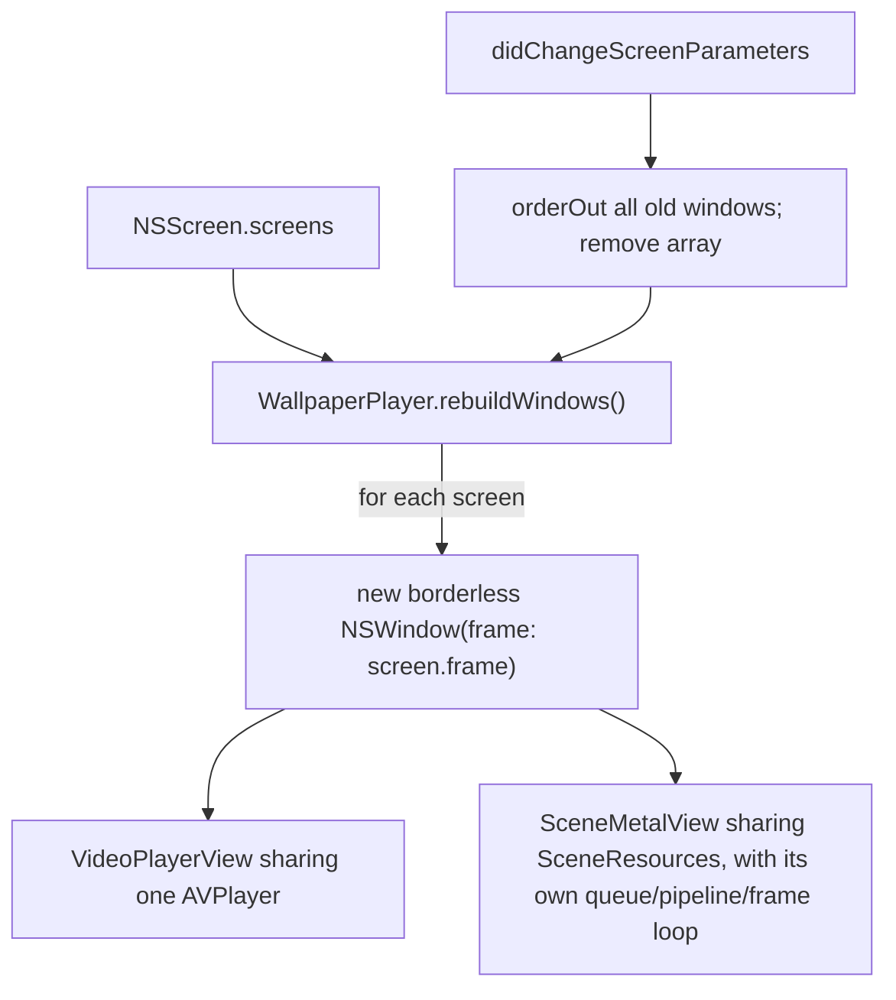
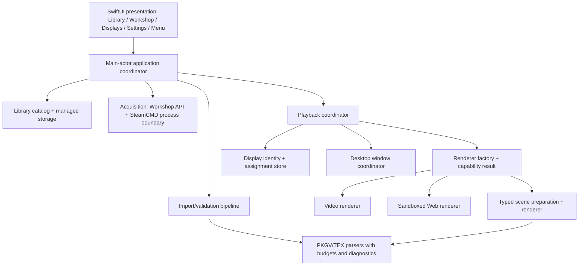

# LumaWall repository analysis

Audit date: 2026-09-13. Audited revision: `80c40364d79e2394006cbeffb901c4c522a692fb` (`main`). Scope: every tracked source, script, test, plist, documentation file, resource, and the complete available Git history.

This document describes the repository as it exists at the audited revision. Names such as `SteamCmdService`, `WorkshopAPIService`, `WorkshopViewModel`, `SceneWallpaperView`, `SceneWallpaperViewModel`, `PKGParser`, `TEXParser`, and `SceneModels` were supplied as areas to inspect, but none of those symbols or files exist in this checkout. Their nearest current equivalents are called out below. Proposed boundaries in section 23 are explicitly future recommendations; they are not descriptions of current code.

## 1. Executive summary

LumaWall is currently a compact, local-only macOS wallpaper player, not yet a Workshop browser/downloader. The entire application is nine Swift files and about 1,450 lines of production Swift. It imports local MP4/MOV/M4V files, Wallpaper Engine video project folders, a narrow subset of Wallpaper Engine scene project folders, and standalone `scene.pkg` files. It stores absolute source paths in `UserDefaults`, keeps the source files in place, and renders one desktop-level window for every current `NSScreen`.

There is no Xcode project, workspace, Swift package, formal app target, asset catalog, entitlements file, App Sandbox, Hardened Runtime configuration, third-party dependency, network client, Workshop UI, Steam Web API client, SteamCMD integration, Steam authentication, Keychain use, Web wallpaper renderer, playlist, cache, managed wallpaper directory, or persistent per-display assignment. The build is a shell script that invokes `swiftc`, assembles an `.app`, and ad-hoc signs it.

The runtime has two renderer paths:

- Video uses one `AVPlayerItem`, one shared `AVPlayer`, and an `AVPlayerLayer` in each display window. It is always muted, loops by seeking on `AVPlayerItemDidPlayToEndTime`, and supports one global fill/fit setting.
- Scene uses an in-memory `PKGV` package reader, a partial `TEXV0005` decoder, and a custom `MTKView` shader. It finds the first image-like scene object and draws its first material texture full-screen. It maps up to three arbitrary effect passes to a wave formula and adds generic fog/ember visuals when particle resource names contain `fog` or `ember`. It is not a general Wallpaper Engine scene renderer.

The most urgent safety issue is in raw TEX upload: `WETexture` does not prove that decoded pixel bytes equal `width * height * channelCount`, and `SceneResources.makeTexture` passes `bytes.baseAddress!` to Metal with a declared row length. A malformed local package can therefore cause an out-of-bounds CPU read, a crash, or extreme allocation pressure. This matters because the app is not sandboxed and explicitly treats imported files as untrusted.

The desktop-window technique uses only public APIs: a borderless `NSWindow` at `CGWindowLevelForKey(.desktopWindow) + 1`, plus `.canJoinAllSpaces`, `.stationary`, `.ignoresCycle`, and `.fullScreenAuxiliary`. No private APIs were found. The use of `CGWindowLevelForKey` is public but Apple documents it as not recommended for application use, so this behavior needs OS-version integration testing before it becomes a foundation for a production redesign.

The checked-in tests and app both build successfully on the audited arm64 machine. The tests exercise only basic importer and package-directory cases. The scene texture decoder, Metal renderer, desktop-window behavior, multi-display output, AVFoundation failure handling, UI, and login item are untested.

## 2. Repository tree

```text
LumaWall/
├── .github/
│   ├── ISSUE_TEMPLATE/
│   │   ├── bug_report.yml
│   │   ├── config.yml
│   │   └── feature_request.yml
│   ├── PULL_REQUEST_TEMPLATE.md
│   └── workflows/ci.yml
├── Docs/
│   ├── ARCHITECTURE.md
│   └── screenshot.png
├── Resources/
│   ├── AppIcon.png
│   └── Info.plist
├── Scripts/
│   ├── build_app.sh
│   └── run_tests.sh
├── Sources/
│   ├── AppState.swift
│   ├── LibraryView.swift
│   ├── LumaWallApp.swift
│   ├── Models.swift
│   ├── ScenePackage.swift
│   ├── SceneRenderer.swift
│   ├── WETexture.swift
│   ├── WallpaperImporter.swift
│   └── WallpaperPlayer.swift
├── Tests/
│   └── main.swift
├── Tools/
│   ├── inspect_scene.swift
│   ├── list_windows.swift
│   └── probe_scene.swift
├── .gitignore
├── CHANGELOG.md
├── CODE_OF_CONDUCT.md
├── CONTRIBUTING.md
├── LICENSE
├── README.md
└── SECURITY.md
```

`build/` is ignored and is created by the shell scripts. `Docs/screenshot.png` is documentation only. The app bundle receives `Resources/AppIcon.png` and `Resources/Info.plist`. The three files under `Tools/` are standalone diagnostics and are not built by either checked-in script or CI.

The repository has one non-shallow root commit, `80c4036` (“Initial open-source release”), no tags, no upstream remote, and no earlier per-feature history. Every line of the multi-display, Workshop-adjacent documentation, scene, Web-policy, and desktop-window code arrived in that commit, so `git log` and `git blame` cannot explain their evolution. `origin` is `git@github.com:JesusArtz/LumaWall.git`, while README badges and clone instructions refer to `jk2005-alt/LumaWall`; the commit author is also `jk2005-alt`. The stated fork relationship to Open Wallpaper Engine is not represented in the available Git ancestry.

## 3. Target and build configuration

There is no `.xcodeproj`, `.xcworkspace`, `Package.swift`, `Package.resolved`, `.xcconfig`, or scheme. Consequently there are no Xcode targets or Xcode-managed build settings. `xcodebuild -list` fails with: “The directory ... does not contain an Xcode project, workspace or package.” The effective logical products are created directly by scripts:

| Logical product | Builder | Inputs | Output |
|---|---|---|---|
| macOS app | `Scripts/build_app.sh` | every `Sources/*.swift` file | `build/LumaWall.app` |
| ad-hoc test executable | `Scripts/run_tests.sh` | `Models.swift`, `ScenePackage.swift`, `WallpaperImporter.swift`, `Tests/main.swift` | `build/tests/LumaWallTests` |
| diagnostics | no checked-in build command | individual `Tools/*.swift` plus relevant sources | none by default |

### App compiler settings

`Scripts/build_app.sh` resolves the current SDK with `xcrun --sdk macosx --show-sdk-path` and the host architecture with `uname -m`, then runs the equivalent of:

```sh
xcrun swiftc \
  -parse-as-library \
  -O \
  -sdk "$SDK_PATH" \
  -target "$ARCH-apple-macosx14.0" \
  -framework SwiftUI \
  -framework AppKit \
  -framework AVFoundation \
  -framework QuartzCore \
  -framework Metal \
  -framework MetalKit \
  -framework CoreGraphics \
  -framework ImageIO \
  -framework ServiceManagement \
  -framework UniformTypeIdentifiers \
  Sources/*.swift \
  -o build/LumaWall.app/Contents/MacOS/LumaWall
```

The script copies the plist and one PNG icon, then runs `codesign --force --deep --sign -`. This is an ad-hoc signature, with no Team ID, entitlements, Hardened Runtime, provisioning, notarization, archive, or distribution workflow. The architecture follows the build host and produces a thin binary. On the audited Apple Silicon host it produced only `arm64`; it is not universal. On an Intel host the same script is expected to request `x86_64`. CI likewise builds for the runner's architecture rather than deliberately validating both architectures.

The script does not pin a Swift language version. The README says Swift 5.9, but the audited build actually used Apple Swift 6.3.3. A strict Swift 5 concurrency typecheck was also run separately and produced no diagnostics; this is an audit check, not part of the repository build.

### Deployment and bundle metadata

`Resources/Info.plist` declares:

| Key | Value / implication |
|---|---|
| `CFBundleIdentifier` | `local.lumawall.app` |
| version | short version `0.1.0`, build `1` |
| `LSMinimumSystemVersion` | macOS `14.0` |
| `LSUIElement` | `true`; agent-style app with no normal Dock presence |
| `NSPrincipalClass` | `NSApplication` |
| `NSHighResolutionCapable` | `true` |
| icon | `AppIcon.png`, a 1024×1024 RGB PNG |

There are no document types, URL schemes, privacy usage strings, application categories, update feeds, or transport-security overrides. No `.entitlements` file exists, and the built signature contains no entitlements. In particular, App Sandbox is disabled.

### Dependencies and frameworks

There are no third-party source or binary dependencies. Production imports and links only Apple frameworks: SwiftUI, AppKit, Foundation/Combine, AVFoundation, QuartzCore, Metal, MetalKit, CoreGraphics, ImageIO, ServiceManagement, and UniformTypeIdentifiers. WebKit, SpriteKit, Security/Keychain, Network, StoreKit, and any Steam SDK are absent.

## 4. App lifecycle

The entry point is `@main struct LumaWallApp: App` in `Sources/LumaWallApp.swift`.



`AppState` constructs its `WallpaperPlayer` before its initializer body. `WallpaperPlayer.init()` reads the global scaling preference and registers selectors for display changes, display sleep/wake, and user-session resign/become-active. `AppState.init()` then restores the library, picks its first item, and asks the player to restore the previously active UUID if `player.shouldResume` is true.

Restoration can therefore begin parsing a package, compiling a Metal shader, and creating desktop windows during app-state initialization, before the SwiftUI scene hierarchy is presented. `LumaWallApp` wraps the `AppState` and that same `AppState.player` instance in separate `@StateObject` properties, then injects both as environment objects into the library, menu, and settings.

The SwiftUI app declares three scenes:

- `Window("LumaWall", id: "library")` hosts `LibraryView` at a default 920×610 size.
- `MenuBarExtra` hosts `StatusMenu`; its icon reflects `player.isPlaying`.
- `Settings` hosts `SettingsView`.

There is no `NSApplicationDelegate`, `scenePhase` handling, termination callback, or explicit activation policy. `LSUIElement` supplies the agent-app behavior. The status menu can reopen the library with `openWindow(id: "library")` and `NSApp.activate(ignoringOtherApps: true)`, or terminate through `NSApp.terminate(nil)`.

While playing, screen sleep and session resignation pause the `AVPlayer` and all `SceneMetalView` instances without changing the user-facing `isPaused`; wake/session activation resumes only if the user had not manually paused. Normal app deactivation, screen lock beyond the workspace notifications, battery state, thermal state, occlusion, and another app entering full screen are not modeled.

### Selection-to-play flow



For video, `rebuildWindows()` completes before `AVPlayer.play()`. For scene, each new `SceneMetalView` sets `isPaused = false`, so its display-driven rendering starts once its window is ordered. No renderer factory or typed dispatch layer exists; `WallpaperPlayer.play(_:)` directly branches on `WallpaperItem.Kind`.

## 5. State architecture

The state model is a small pair of main-actor `ObservableObject`s rather than a reducer, store, or service graph.

| Owner | State | Mutation / propagation |
|---|---|---|
| `AppState` | `library`, `selectedID`, `alertMessage`, `launchAtLogin` | `@Published`; injected into SwiftUI as an environment object |
| `WallpaperPlayer` | `isPlaying`, `isPaused`, `currentItem`, `lastError`, `scaling` | `@Published`; injected separately as an environment object |
| `WallpaperPlayer` | `AVPlayer`, `SceneResources`, `[NSWindow]`, observer token, system-pause flag | private reference state, main actor |
| `UserDefaults.standard` | library JSON, scaling, active UUID, resume flag | immediate side effects in `AppState` and `WallpaperPlayer` |
| `SMAppService.mainApp` | login-item status | read at `AppState` creation; changed through `setLaunchAtLogin(_:)` |
| individual SwiftUI views | drag target highlighting | local `@State` |

```mermaid
flowchart LR
    UI["LibraryView / StatusMenu / SettingsView"] -->|commands and Bindings| AS["AppState"]
    UI -->|commands and scaling Binding| WP["WallpaperPlayer"]
    AS -->|owns| WP
    AS -->|library JSON| UD["UserDefaults"]
    WP -->|scaling, active UUID, resume| UD
    AS -->|register/unregister| SM["SMAppService.mainApp"]
    WP --> AV["AVPlayer"]
    WP --> SR["SceneResources"]
    WP --> WS["NSWindow array"]
    AS -->|@Published| UI
    WP -->|@Published| UI
```

There are no Combine `sink` subscriptions or cancellable collections; SwiftUI observes `@Published` through `EnvironmentObject`. There is also no dependency injection around defaults, files, screens, the clock, Metal, ServiceManagement, or AVFoundation, which makes stateful behavior difficult to test.

All library imports and player commands are main-actor operations. `WallpaperImporter.inspect`, package loading, JSON parsing, ImageIO decoding, Metal texture allocation/upload, runtime Metal library compilation, and window rebuilding therefore happen synchronously as part of main-actor calls. Drag-and-drop loads the item-provider value asynchronously, but explicitly hops to `Task { @MainActor ... }` before performing the expensive inspection.

### Error propagation

- Import and login-item errors become `AppState.alertMessage`.
- Scene preparation errors become `WallpaperPlayer.lastError`.
- `LibraryView` combines both into one alert and clears both when dismissed.
- A missing source at playback time returns silently.
- A failed per-screen `SceneMetalView` initializer is discarded with `try?`, silently omitting that screen.
- AVPlayer readiness, item failure, decode failure, stalling, and error-log state are never observed.
- UserDefaults decode/encode errors and drag provider errors are silently ignored.
- Metal draw/command failures return without logging or updating state.

### UI architecture

There is no navigation coordinator or sidebar destination model. `LibraryView` is the entire main window and uses a fixed horizontal split built from an `HStack`:

- The 238-point sidebar contains branding, a scrollable `ForEach(state.library)`, the add button, item count, and selected-item delete button. Tapping a `WallpaperRow` assigns `state.selectedID`.
- A row context menu offers “Set as Live Wallpaper” and “Remove from Library.” There are no batch actions or multi-selection.
- The detail side shows either `WallpaperDetail` or `EmptyLibraryView`. `WallpaperDetail` displays a static project preview/fallback, name/type, playback controls, and the global segmented fill/fit picker. It is not a live renderer preview.
- `EmptyLibraryView` supplies the first-import call to action and drag-target styling.
- `StatusMenu` supplies current-item label, pause/resume, stop, import, reopen, settings, and quit.
- `SettingsView` has a General tab with launch-at-login and the same global scaling picker, plus a static About tab.

There is no Workshop screen, top-level destination sidebar, wallpaper-detail route, display-management screen, playlist screen, recent-items screen, search, toolbar, inspector, subscription UI, or navigation history. Display configuration is only the one global scaling choice.

`WallpaperRow` and `EmptyLibraryView` are mostly value/closure-driven and could be extracted, but they are private to `LibraryView.swift`. `WallpaperDetail`, `LibraryView`, `StatusMenu`, and `SettingsView` directly consume `AppState`/`WallpaperPlayer` environment objects. Preview filesystem I/O happens inside `WallpaperRow` and `WallpaperDetail`, further coupling presentation to storage. Business operations themselves remain in `AppState`/`WallpaperPlayer`, although views directly orchestrate small sequences such as selecting an item and then playing/removing it.

## 6. Data models

`Sources/Models.swift` contains the only durable application model:

- `VideoScaling`: `fill` or `fit`; despite its name it also controls scene scaling.
- `WallpaperItem`: `Codable`, `Hashable`, `Identifiable`, with a random `UUID`, display `name`, absolute `sourcePath`, optional absolute `previewPath`, and `Kind`.
- `WallpaperItem.Kind`: only `video` and `scenePackage`.
- `ImportError`: missing item, unsupported extension, invalid project, unsupported project type, and missing video.

`WallpaperItem.sourceURL` and `previewURL` are computed from stored strings. The model does not retain the project folder, original `project.json`, Workshop ID, Steam App ID, content hash, author, description, tags, rating, age/content rating, local acquisition source, install version, file size, creation/modification date, renderer capabilities, display assignments, playback options, or security-scoped bookmark.

Parser/renderer-only structures are:

- `ScenePackageEntry(path, offset, length)` and `ScenePackage(version, entries, data, payloadOffset)`.
- `WETexture(format, width, height, pixels)`.
- `WavePass(direction, speed, scale, strength, perspective, maskPath)`.
- private `SceneUniforms`, mirroring the embedded Metal shader layout.

There is no typed `Project` outside the importer's private four-field decoding struct. Scene data is handled as `[String: Any]`; there is no `SceneModels.swift`, no typed scene graph, and no preservation of parsed-but-unsupported data for diagnostics.

## 7. Wallpaper storage

The app has no managed wallpaper storage directory and never copies imported content.

| Data | Current location | Read/write behavior |
|---|---|---|
| imported video | original user-selected path | read in place by AVFoundation |
| project video | original `project.json` relative target | stored as the resolved absolute video path; project folder identity is lost |
| standalone scene | original `.pkg` path | read in place at import and again at playback |
| scene project | fixed `<selected folder>/scene.pkg` | stored as the package path; project folder identity is lost |
| preview | original path from `project.preview` | synchronously loaded by `NSImage(contentsOf:)` in views |
| library catalog | `UserDefaults` key `wallpaper.library.v1` | JSON-encoded `[WallpaperItem]` |
| scaling | `UserDefaults` key `player.scaling` | `fill` or `fit` string |
| active wallpaper | `UserDefaults` key `player.activeID` | UUID string |
| relaunch intent | `UserDefaults` key `player.shouldResume` | Boolean |
| login registration | ServiceManagement system state | managed by `SMAppService.mainApp` |
| preview cache | none | no app cache exists |
| runtime temporary files | none | packages are parsed in memory and not extracted by the app |
| test temporary files | `FileManager.default.temporaryDirectory/lumawall-<UUID>` | deleted by `defer` in `Tests/main.swift` |
| build/module cache | repository-local ignored `build/` | produced only by scripts |
| manual package extraction | caller-selected path for `Tools/inspect_scene.swift --extract` | diagnostic tool only; not an app flow |
| ZIP files / SteamCMD data | none | unsupported / absent |

The effective preferences file is in the standard preferences domain for bundle identifier `local.lumawall.app` (normally represented by macOS under the user's Library preferences). The app itself uses `UserDefaults`, not a hardcoded plist path.

### Identity and collisions

Every new `WallpaperItem` receives a random UUID. That UUID survives relaunch because the full item array is encoded, and `player.activeID` points back to it. There is no deterministic identity, content hashing, or Workshop ID preservation.

`AppState.importWallpaper` deduplicates only when the new `sourcePath` string exactly equals an existing one. It does not standardize both paths, resolve aliases/symlinks, compare file resource identifiers, or compare content. The same file can therefore be added under textually different paths. Conversely, reimporting the exact same stored path selects and optionally plays the old item without refreshing its name, preview, or kind.

Two wallpapers with the same display name coexist without conflict because IDs are UUIDs and no name-based lookup is used. The UI shows duplicate rows with the same label. Removing an item deletes only its catalog row; it never deletes source content.

At launch, entries whose `sourcePath` is missing are filtered from the in-memory library. The filtered array is not saved, so stale records remain in defaults and are retried on each launch. Preview existence is not checked at launch. Persistent access currently works only because the app is unsandboxed; an App Sandbox migration would require security-scoped bookmarks or managed copies.

## 8. Import architecture

There are two entry mechanisms:

- `AppState.chooseWallpaper()` shows a synchronous modal `NSOpenPanel` that allows one file or directory and does not constrain content types.
- `LibraryView.drop(_:)` accepts file URLs, processes only the first provider, and calls the same `AppState.importWallpaper` path on the main actor.



### Direct videos

Only filename extensions are validated (`mp4`, `mov`, `m4v`, case-insensitive). The importer does not inspect the file header, create an `AVAsset`, verify tracks/codecs, or wait for playability. The checked-in test deliberately uses three arbitrary bytes as an `.mp4`, so it verifies extension/path handling rather than playable media.

### Video project folders

The importer requires a decodable lowercase `project.json`, lowercases `project.type`, requires it to equal `video`, reads `project.file`, standardizes the resulting URL, checks a lexical `selected-folder/` prefix, checks existence, and checks the same three extensions. It uses the trimmed `title` or the folder name. The lexical containment check rejects `../` traversal after standardization but does not resolve symlinks, so an in-folder symlink can still target an external file.

### Scene project folders and standalone packages

A folder whose type lowercases to `scene` is assumed to contain exactly `scene.pkg`; the importer ignores `project.file`. It parses the package directory and requires an exact entry named `scene.json`. A standalone file with any case-insensitive `.pkg` extension follows the same package/header/directory check. Neither path validates render compatibility during import, so an item can be accepted and fail only when played.

For a folder, `project.preview` is appended and retained only if a file currently exists. For a standalone package, a neighboring `project.json` is optional; its title and preview are used, but the preview's existence is not checked. Preview paths are not standardized or constrained to the selected project directory, so `..` components may make the app read an image elsewhere on the accessible filesystem. This is local read behavior, not a network exfiltration path in the current app.

### Destination and refresh behavior

There is no destination directory, copy, move, archive expansion, content normalization, or library scan. “Library refresh” is only array insertion plus `UserDefaults` encoding. ZIP import is unsupported. Moving an imported source later breaks the item; on the next launch the item disappears from memory.

## 9. Workshop architecture

No Workshop architecture is present. There is no Workshop screen, navigation route, service, view model, model, API key, HTTP client, search query, sort model, content-rating filter, pagination, thumbnail downloader, metadata fetch, subscription state, download queue, cancellation, retry, or local import bridge.

The requested example symbols `WorkshopAPIService` and `WorkshopViewModel` do not exist. The word “Workshop” appears only in documentation about file provenance/copyright. The application imports no networking framework and contains no `URLSession` use.

Accordingly, the intended Workshop flow currently terminates at every step:

```text
Workshop UI                 ABSENT
→ API request               ABSENT
→ result model              ABSENT
→ Steam authentication      ABSENT
→ SteamCMD                  ABSENT
→ download                  ABSENT
→ copy/import               ABSENT
→ local library             only manual local imports exist
→ playback                  local video / narrow scene support exists
```

Workshop App ID handling, Workshop IDs, search/sort/filter semantics, page cursors, metadata, thumbnail caching, and subscribe/unsubscribe behavior are therefore not implemented and cannot be inferred from this repository.

## 10. Steam authentication and download architecture

`SteamCmdService` is absent, as are SteamCMD discovery, installation, process launching, authentication, Steam Guard, credential persistence, Workshop App ID configuration, command construction, progress parsing, cancellation, retry, and download-directory handling.

No production code uses `Process`, `NSTask`, `/bin/sh`, `/bin/zsh`, AppleScript, or any other command-execution mechanism. There is therefore no Steam command interpolation to audit and no authentication bypass. No credentials, cookies, tokens, API keys, account names, passwords, or Steam Guard values are stored in source, `UserDefaults`, Keychain, or app files.

The only shell execution is in developer build scripts. Their dynamic values are the script's own resolved repository directory, `xcrun`'s SDK path, and `uname -m`; all are quoted when passed to tools. They do not interpolate wallpaper metadata or user credentials.

Any future Steam integration is new architecture. It must preserve legitimate Steam ownership/authentication requirements rather than trying to infer an absent implementation from this prototype.

## 11. Desktop window architecture

All wallpaper-window work is inside `WallpaperPlayer.rebuildWindows()` and the private `NSWindow.configureDesktopWindow(content:screen:)` extension in `Sources/WallpaperPlayer.swift`.

For every current `NSScreen`, `rebuildWindows()` creates:

```swift
NSWindow(
    contentRect: screen.frame,
    styleMask: .borderless,
    backing: .buffered,
    defer: false
)
```

It then configures each window as follows:

| Property/call | Current value | Effect |
|---|---|---|
| `contentView` | `VideoPlayerView` or `SceneMetalView` | renderer fills the borderless window |
| `level` | `CGWindowLevelForKey(.desktopWindow) + 1` | puts content immediately above the standard desktop level, relying on the window-server ordering around Finder desktop content/icons |
| `collectionBehavior` | `.canJoinAllSpaces` | asks for presence in all Spaces |
| | `.stationary` | Mission Control leaves the window stationary like the desktop |
| | `.ignoresCycle` | excludes it from Cycle Through Windows |
| | `.fullScreenAuxiliary` | allows it on the same Space as a full-screen window |
| `ignoresMouseEvents` | `true` | all pointer events pass through |
| `isOpaque` | `true` | compositor may treat it as fully opaque |
| `backgroundColor` | black | letterboxing/failure background |
| `hasShadow` | `false` | avoids a desktop-sized shadow |
| `isReleasedWhenClosed` | `false` | explicit non-release-on-close policy; windows are never actually closed by this code |
| `setFrame` | `screen.frame` | uses AppKit global screen coordinates |
| ordering | `orderFrontRegardless()` | orders every newly built wallpaper window to the front at its low level |

The numeric-level trick is built from public Core Graphics and AppKit APIs; no private framework, selector, symbol, or SPI was found. Apple lists `.desktopWindow` as a standard `CGWindowLevelKey`, while the documentation for `CGWindowLevelForKey` says the function is intended for frameworks and is not recommended for applications. This is a supportability caveat, not evidence of private API use. See [Apple's window-level key documentation](https://developer.apple.com/documentation/coregraphics/cgwindowlevelkey) and [`CGWindowLevelForKey`](https://developer.apple.com/documentation/coregraphics/cgwindowlevelforkey(_:)).

Apple documents `.stationary` as remaining visible and stationary in Mission Control, `.canJoinAllSpaces` as appearing in all Spaces, `.fullScreenAuxiliary` as sharing the full-screen Space, and `.ignoresCycle` as exclusion from window cycling. See [NSWindow collection behaviors](https://developer.apple.com/documentation/appkit/nswindow/collectionbehavior-swift.struct). The code has no Stage Manager-specific `auxiliary` or `canJoinAllApplications` policy.

The implementation does not use a custom `NSPanel`, window controller, delegate, parent/child relationship, `canBecomeKey` override, explicit `screen` assignment, desktop/Finder process discovery, `CGS` private API, or macOS wallpaper configuration API. Mouse passthrough is unconditional; there is no optional wallpaper interaction.

### Resizing, screen changes, and full-screen apps

Windows are not incrementally resized. `NSApplication.didChangeScreenParametersNotification` calls `screensChanged()`, which discards every old window and creates a new set from the current `NSScreen.screens`. There are no window/screen-specific observers or display-reconfiguration callbacks.

No code detects full-screen applications, app occlusion, the active Space, Mission Control transitions, Stage Manager, or whether the desktop is visible. The low window level normally leaves application windows visually above the wallpaper, and `.fullScreenAuxiliary` allows participation in full-screen Spaces, but the renderer is not paused merely because a full-screen app covers it. These interactions were not exercised by the automated tests and need a macOS version/display/Space test matrix.

## 12. Multi-display architecture

There is no `DisplayManager` and no persistent display identity. The app never reads `NSScreenNumber`, `CGDirectDisplayID`, display UUIDs, localized screen names, arrangement, primary-display status, or mirroring state. It stores no per-display selection, scaling, enablement, or playback position.



Every display shows the same active wallpaper and the same global fill/fit mode. Video windows all point to one `AVPlayer`; scene windows share immutable `SceneResources`/textures but each compile a pipeline, own a command queue, have their own start timestamp, and draw independently at 30 fps. Since each scene view records `started` during construction, animation phases can differ slightly across displays and are reset whenever screens are rebuilt.

For video, `preferredMaximumResolution` is chosen once when playback starts from the largest current screen's point size multiplied by its backing scale. Connecting a larger/higher-density screen rebuilds layers/windows but does not recompute that preference. Screen removal/reconnection does not restore an assignment because none exists; it simply recreates the same wallpaper everywhere.

There is a material compatibility risk in attaching one player to multiple `AVPlayerLayer`s. Apple's current initializer documentation says an arbitrary number of layers may be created for one player, while its archived AVFoundation Programming Guide says only the most recently created layer displays video. See [current `AVPlayerLayer.init(player:)` documentation](https://developer.apple.com/documentation/avfoundation/avplayerlayer/init(player:)) and the [archived playback guide](https://developer.apple.com/library/archive/documentation/AudioVideo/Conceptual/AVFoundationPG/Articles/02_Playback.html). The repository has no multi-display video test or hardware evidence resolving that discrepancy. Simultaneous output must be validated on every supported macOS generation before this design is preserved.

## 13. Video renderer

The complete video path is in `WallpaperPlayer.play(_:)`, private `VideoPlayerView`, and `NSWindow.configureDesktopWindow`.

1. `play(_:)` calls `stop(forget: false)` and silently returns if the source path no longer exists.
2. It constructs `AVPlayerItem(url:)` directly from the file URL.
3. It sets `preferredForwardBufferDuration = 1`.
4. It sets `preferredMaximumResolution` from the largest current screen, if one exists.
5. It constructs one `AVPlayer`, sets `isMuted = true`, `actionAtItemEnd = .none`, and `automaticallyWaitsToMinimizeStalling = false`.
6. `activate(_:)` publishes current state and persists the active UUID/resume flag.
7. A main-queue `AVPlayerItemDidPlayToEndTime` observer seeks to exact zero with zero tolerance and calls `play()` again.
8. `rebuildWindows()` creates one `VideoPlayerView`/`AVPlayerLayer` per screen, all bound to the same player.
9. The player starts.

`VideoPlayerView` is a layer-backed `NSView` with a black background. It adds a plain `AVPlayerLayer` and updates that layer to `bounds` during `layout()` with implicit Core Animation actions disabled.

### Supported controls and behavior

| Capability | Actual implementation |
|---|---|
| loop | end notification → exact seek to zero → `play`; no `AVPlayerLooper` |
| audio | always muted; no volume or unmute setting |
| playback speed | none; `play()` uses normal rate |
| fill | `AVLayerVideoGravity.resizeAspectFill` |
| fit | `AVLayerVideoGravity.resizeAspect`, with black window background |
| pause/resume | `AVPlayer.pause()` / `play()` |
| sleep/session | automatic pause/resume through `NSWorkspace` notifications |
| relaunch | active UUID and resume Boolean in defaults |
| multiple displays | multiple layers sharing one player; compatibility unverified as described above |
| item readiness/errors | not observed |
| buffering/progress | not exposed |
| HDR/color policy | AVFoundation defaults; no explicit handling |

The notification-based loop can have a visible seam because it reacts after end-of-item and seeks. The player uses no periodic timer and no custom decode loop. AVFoundation manages decoding/concurrency internally.

## 14. Web renderer

There is no Web renderer. WebKit is neither imported nor linked; no `WKWebView`, `WKWebViewConfiguration`, `WKWebsiteDataStore`, content controller, JavaScript bridge, local-file read grant, navigation delegate, WebGL setting, autoplay/media policy, mouse forwarding, or Wallpaper Engine Web API exists.

A project whose `project.json.type` is `web` reaches `ImportError.unsupportedProject("web")`. Therefore:

- local file access: not applicable;
- JavaScript execution: disabled by absence;
- WebGL: not applicable;
- media/autoplay: not applicable;
- mouse input: no wallpaper receives mouse input because desktop windows ignore mouse events;
- Wallpaper Engine web APIs: absent;
- Web security surface: currently absent.

README and SECURITY claims that web wallpapers/scripts are not executed are consistent with the code.

## 15. Scene renderer

The requested SpriteKit architecture is not present. `SceneWallpaperView.swift` and `SceneWallpaperViewModel.swift` do not exist, and SpriteKit is neither imported nor linked. Their functional equivalents are `SceneResources` and `SceneMetalView` in `Sources/SceneRenderer.swift`, implemented directly with MetalKit.

### Preparation path

`WallpaperPlayer.play(_:)` synchronously creates one `SceneResources(packageURL:)`. That initializer:

1. Requires `MTLCreateSystemDefaultDevice()`.
2. Opens `ScenePackage` and loads exact entry `scene.json`.
3. Parses it with `JSONSerialization` into a dictionary and requires an `objects` array of dictionaries.
4. Chooses the first object for which the `image` key is present.
5. Treats that value as the path to another package JSON dictionary (the image model).
6. Reads its `material` path and parses that JSON dictionary.
7. Requires a `passes` array and takes the first string in the first pass's `textures` array.
8. Constructs `materials/<textureName>.tex`, decodes it with `WETexture`, uploads it to Metal, and uses its pixel dimensions as the source aspect ratio.
9. Walks every `effect` pass on the selected image object, regardless of effect/shader type, maps constants to `WavePass`, and retains only the first three.
10. Loads each wave's second texture as a mask from `materials/<name>.tex`; absent/missing masks become a 1×1 white R8 texture.
11. Sets `hasFog` when any object's `particle` string contains lowercase `fog`, and similarly sets `hasEmbers` for lowercase `ember`.

The implementation does not verify that an effect pass actually represents a water/wave shader. Any effect pass is treated as a wave, with defaults of direction 0, speed 5, scale 200, strength 0.1, and perspective 0 when keys are absent or not bridge-castable as `Double`.

### Drawing path

`WallpaperPlayer.rebuildWindows()` creates a `SceneMetalView` for each screen. Each view:

- creates its own command queue;
- compiles the embedded Metal source string at runtime;
- creates its own BGRA8 render pipeline;
- draws continuously at `preferredFramesPerSecond = 30`;
- uses a full-screen triangle, not scene geometry or SpriteKit nodes;
- computes time from that view's own `CACurrentMediaTime()` start;
- sends source/view aspect, global fit/fill mode, three possible waves, and fog/ember flags as uniforms;
- samples the shared base texture and masks with clamp-to-edge/linear filtering;
- applies up to three sinusoidal UV offsets;
- adds a low-amplitude procedural fog brightness pattern;
- adds procedural orange grid/hash “embers”;
- forces output alpha to 1.

### Positioning, scaling, blend, and tint

There is no scene-object positioning. The base texture is centered and covers or fits the entire display based only on its decoded pixel aspect ratio. The importer ignores object origin, position, scale, rotation, camera, parallax, alignment, visibility, z-order, and source scene dimensions.

There are no blend-mode, opacity, tint, color, alpha, material-shader, render-target, or compositing implementations. Only one base image is drawn; other images and all real particle geometry are ignored. The shader's generated fog/ember additions are not decoded Wallpaper Engine particle systems.

### Fallbacks and failure paths

- Missing/invalid `scene.json`, model JSON, material JSON, first pass/texture, or base TEX fails scene preparation.
- A scene with no image-like object reports `ImportError.unsupportedProject("scene without a base image")`.
- A missing mask uses white, applying the wave everywhere.
- A present but invalid mask fails the whole wallpaper.
- More than three mapped passes are silently ignored.
- Missing numeric constants silently use defaults.
- Unsupported scene objects/effects are silently ignored rather than reported as a capability warning.
- Metal device/library/pipeline/queue failures become an error only while `SceneResources` or the first-stage setup throws.
- Per-screen `SceneMetalView` failures are swallowed by `try?`; the other screens continue and `isPlaying` remains true even if no scene window was created.
- Draw-time drawable, command-buffer, encoder, or presentation failures silently drop the frame.

The README statement that image scenes, masked water waves, fog, and embers are supported should be read narrowly: the code displays one texture, assumes all effect passes are waves, and creates generic fog/ember approximations based on resource-name substrings. It does not reproduce the original scene graph or particle definitions.

## 16. PKG and TEX parsing

The requested `PKGParser.swift`, `TEXParser.swift`, and `SceneModels.swift` are absent. Current parsing lives in `ScenePackage.swift`, `WETexture.swift`, and untyped dictionary traversal in `SceneRenderer.swift`.

### PKGV package reader

`ScenePackage` loads the entire file with `Data(contentsOf:options: [.mappedIfSafe])`. The expected layout is:

```text
UInt32LE versionByteCount
UTF-8 version bytes                 must start with "PKGV"
UInt32LE entryCount                 maximum 100,000
repeat entryCount times:
    UInt32LE pathByteCount          maximum 1,048,576
    UTF-8 path bytes
    UInt32LE payloadRelativeOffset
    UInt32LE payloadLength
payload bytes                       starts immediately after directory
```

Entry offsets are interpreted relative to the byte after the complete directory, not the file start. The initializer bounds-checks every primitive, rejects invalid UTF-8, validates every entry range against the payload, and rejects paths that are empty, begin with `/`, or have a `..` component after replacing backslashes with slashes. It caps the entry count and individual path length, but not total package size, total declared payload, aggregate extraction size, duplicate paths, or supported PKGV versions. Any version string beginning `PKGV` is accepted.

`contains(_:)` and `data(for:)` perform linear exact-path searches; `data(for:)` copies a subrange into a new `Data`. Duplicate names are allowed and lookup returns the first, while extraction iterates all duplicates and can overwrite an earlier extracted file. Validation normalizes backslashes only for checking and stores the original path, so a safe Windows-style `folder\\file` extracts as a filename containing a backslash on macOS rather than a directory hierarchy.

`extract(to:)` is unused by the app. The diagnostic tool can call it. It creates directories, standardizes each destination URL, and repeats a lexical `destination/` prefix check before atomic writes. This blocks ordinary absolute/`..` traversal. It does not resolve pre-existing symlinks inside a caller-supplied destination.

### TEX reader

`WETexture` accepts this narrow structure:

```text
"TEXV0005\0"
"TEXI0001\0"
UInt32LE format                     only 0, 8, 9
UInt32LE flags                      parsed, discarded
UInt32LE allocatedWidth             parsed, discarded
UInt32LE allocatedHeight            parsed, discarded
UInt32LE realWidth                  parsed, discarded
UInt32LE realHeight                 parsed, discarded
UInt32LE unknown                    parsed, discarded
"TEXB0003\0" or "TEXB0002\0"
UInt32LE imageCount                 must be > 0; otherwise unused
[UInt32LE freeImageFormat]          only for TEXB0003
UInt32LE mipCount                   must be > 0; otherwise unused
first mip only:
    UInt32LE mipWidth
    UInt32LE mipHeight
    UInt32LE compression            0 = raw; 1 = raw LZ4 block
    Int32LE uncompressedSize
    Int32LE storedSize
    stored bytes
```

Only the first image and first mip are consumed. Remaining images/mips and trailing bytes are ignored. Compression 1 is decoded by the private bounds-checked `LZ4Block` implementation; compression 0 uses stored bytes directly. Other compression values fail.

When `freeImageFormat` is nonzero and not `UInt32.max`, ImageIO decodes the stored/expanded data to a `CGImage`, then a `CGContext` converts it to premultiplied-last RGBA8. Otherwise bytes are returned in their raw form and the first-mip dimensions are trusted.

`SceneResources.makeTexture` maps format 9 to Metal `r8Unorm`, format 8 to `rg8Unorm`, and format 0 to `rgba8Unorm`; mipmapping is disabled. Flags, allocated/real dimensions, image count, additional mip levels, channel swizzles, color space, texture arrays/cubemaps, and any other TEX versions/formats are not implemented.

### Parsed but unused data

| Source | Used | Parsed then ignored / not parsed |
|---|---|---|
| `project.json` | title, type, video file, preview | all other metadata; scene `file` is ignored |
| `scene.json` | `objects`, first object with `image`; particle filename substrings | scene settings and every other object property |
| image model JSON | `material` | geometry/transforms and all other fields |
| material JSON | first pass's first base texture | shaders, constants, blending, later base passes, render state |
| effect passes | five named constants, second texture as mask | effect identity/shader, other constants/textures; passes after the first three mapped waves |
| TEX info | version/header, format, first mip dimensions/data | flags, allocated/real size fields, extra unknown field, extra images/mips |

### Parser safety gaps

The low-level readers do many correct range checks, but important gaps remain:

1. Raw decoded byte count is not checked against `mipWidth * mipHeight * channelCount`. Metal's `replace(region:...withBytes:bytesPerRow:)` is then given an unbounded pointer and a declared row size, so it may read beyond the `Data` buffer.
2. Dimensions and size fields lack reasonable resource caps. A package can request near-2 GiB LZ4 output, or ImageIO can produce dimensions whose `width * height * 4` allocation exhausts memory or traps on overflow.
3. The ImageIO branch always produces RGBA bytes but leaves `format` unchanged. If a free-image payload declares format 8 or 9, `makeTexture` interprets the RGBA buffer as two or one channels with a shorter row stride.
4. `bytes.baseAddress!` is force-unwrapped. Stored/decoded data is required nonempty, but a correct explicit byte-count contract should make the pointer and length safe rather than relying on that invariant.
5. There is no fuzz corpus, malformed TEX test, renderer fixture, or sanitizer CI.

## 17. Performance model

### Concurrency model

Application-owned mutable state is concentrated in main-actor `AppState` and `WallpaperPlayer`; AppKit windows/views are also manipulated from that path. The code creates no custom actor, dispatch queue, task group, detached task, or explicit lock. AVFoundation performs media work internally, and MetalKit schedules `SceneMetalView.draw(in:)`; `SceneResources` is immutable after construction. The only explicit `Task` is the drag/drop hop back to `@MainActor`. A complete strict-concurrency typecheck produced no diagnostics, and no definite data race was found. Selector-based NotificationCenter delivery is not expressed as a Swift concurrency contract, so the player relies on the system screen/workspace notifications being delivered compatibly with its main-actor mutations.

### Main-thread work

`AppState` and `WallpaperPlayer` are `@MainActor`. Direct imports synchronously read project metadata/package directories; scene playback synchronously maps the full package, copies JSON/TEX entries, performs LZ4 or ImageIO decode, creates Metal textures, and compiles one shader pipeline per display. Large or malformed inputs can block the UI for a long time. Library rows/details synchronously call `NSImage(contentsOf:)` from SwiftUI body evaluation, which can repeatedly decode large previews during updates and scrolling.

### Video CPU/GPU/battery

- One `AVPlayer` performs decoding; every display gets an `AVPlayerLayer` attached to it.
- Playback continues whenever `isPlaying && !isPaused`, even if all desktop windows are covered by normal/full-screen applications.
- Only display sleep and user-session resignation automatically pause it.
- `automaticallyWaitsToMinimizeStalling = false` favors immediate playback over buffering stability.
- Looping performs an end notification and exact seek, adding end-of-loop work and possible visible gaps.
- No timer or custom frame loop is present in application code.

### Scene CPU/GPU/battery

- Every display owns an independent continuously drawing `MTKView` at 30 fps.
- Textures in `SceneResources` are shared, avoiding duplicate base/mask GPU allocations per display.
- Command queues and render pipelines are not shared; the embedded shader is compiled separately for each screen and again after any screen-parameter change.
- Every frame builds arrays for wave uniforms, allocates/commits a command buffer, and renders a full-display triangle with up to four texture samples plus procedural effects.
- There is no drawable/occlusion/desktop-visibility throttling, dynamic FPS, Low Power Mode response, or thermal response.
- Manual and system pause set `MTKView.isPaused`, which does stop its scheduled draw loop.

### Lifetimes, observers, and possible retention

`WallpaperPlayer` retains one player or one scene-resource set and the window array. Switching/stop pauses and clears the player/resources, removes the end observer, orders windows out, and removes them from the array. Selector observers are removed in `deinit`; the block observer captures the local AVPlayer weakly. No obvious closure retain cycle was found.

The code never calls `close()` on wallpaper windows and sets `isReleasedWhenClosed = false`; it relies on dropping the array after `orderOut`. This should be measured with repeated play/screen-change cycles because there is no allocation/leak test. Likewise, view/layer/player teardown and Metal resource release are not instrumented.

There are no explicit caches, Combine subscription bags, polling timers, `DispatchQueue` loops, or application `Timer`s. AVFoundation, MetalKit, SwiftUI, and WebKit-absent system internals are the only implicit schedulers. The app has no performance telemetry or signposts.

## 18. Security considerations

### Positive properties

- Web content, JavaScript, Wallpaper Engine scripts, Windows executables, and application wallpapers are never executed.
- There is no network client, analytics, upload, remote URL ingestion, Steam account handling, or credential persistence.
- There is no production shell/process execution and thus no current command-injection surface.
- `ScenePackage` checks primitive bounds, directory ranges, UTF-8 paths, simple traversal components, and a maximum entry count/path length.
- Video project targets receive a lexical parent-directory check after standardization.
- The package extraction helper uses atomic writes and a second standardized-prefix check, although the app does not invoke extraction.

### Risks

- **Untrusted TEX memory safety/resource exhaustion:** the unchecked pixel-size contract and uncapped allocation metadata described in section 16 are the highest-priority issue.
- **Broad filesystem authority:** the app is ad-hoc signed without App Sandbox or Hardened Runtime. Imported parsers and ImageIO run with the user's process permissions, subject only to normal macOS privacy controls.
- **Symlink/preview containment:** video project containment is lexical and can be bypassed by symlinks; preview paths can include traversal outright. Current impact is local file reading/presentation, but this becomes more serious if thumbnails are uploaded, shared, or processed by future network features.
- **Format/version ambiguity:** any `PKGV*` version is accepted, and an import only checks for `scene.json`; unsupported data reaches deeper parsers later.
- **Denial of service:** complete package mapping, copied subranges, decompression, ImageIO decoding, texture allocation, and shader compilation are synchronous and lack cancellation or resource budgets.
- **Diagnostic extraction:** `Tools/inspect_scene.swift --extract` is not app code, but callers should use a new empty destination because pre-existing symlinks are not resolved during containment checks.
- **Distribution posture:** ad-hoc signing, no notarization, no hardened runtime, and a local-style bundle identifier are suitable only for local development.

There is no authentication implementation to bypass or review. Future Steam credentials should never be placed in command strings, logs, `UserDefaults`, or project metadata.

## 19. Current feature matrix

| Feature | Status | Evidence / boundary |
|---|---|---|
| direct MP4/MOV/M4V import | partial | extension/existence only; no codec/playability validation |
| Wallpaper Engine video project folder | partial | `project.json` type/file/title/preview only |
| standalone `scene.pkg` | partial | PKGV directory + `scene.json`; narrow renderer compatibility |
| Wallpaper Engine scene project folder | partial | fixed `scene.pkg`; ignores project `file` |
| Wallpaper Engine Web wallpaper | unsupported | explicitly rejected; no WebKit |
| application/executable wallpaper | unsupported | rejected by type; no execution |
| Workshop browse/search/sort/filter | absent | no UI/model/network/service |
| Steam authentication / Steam Guard | absent | no Steam code or credential store |
| SteamCMD discovery/download/progress/cancel | absent | no `Process` use |
| managed local library | absent | references original absolute paths |
| ZIP import | absent | `.zip` is unsupported |
| project preview | partial | local `project.preview`, loaded synchronously |
| preview cache | absent | no cache directory/model |
| menu bar controls | implemented | add/open/settings/pause/resume/stop/quit |
| launch at login | implemented, untested | `SMAppService.mainApp` |
| global fill/fit | implemented | shared across all wallpapers/displays |
| video loop | implemented with possible seam | end notification + seek |
| volume | fixed muted | no control |
| playback speed | absent | normal `play()` only |
| pause on display/session sleep | implemented | workspace notifications |
| pause behind full-screen/covered apps | absent | no occlusion/full-screen monitoring |
| same wallpaper on every screen | implemented structurally | one window per `NSScreen`; video-layer behavior needs hardware validation |
| per-display wallpaper/options | absent | no display identity/state |
| display reconnect restoration | absent | wholesale rebuild, no assignment |
| playlists / scheduling | absent | no model or UI |
| batch actions | absent | single selection/import/remove |
| recent wallpapers | implicit only | library insertion order, no recent-history model |
| context menu | minimal | play and remove |
| scene base image | narrow partial | first image → first material/pass/texture only |
| scene water waves | approximation | every effect pass mapped to wave; max three |
| scene fog/embers | approximation | generic procedural overlay from lowercase filename substring |
| scene positioning/blending/tint | absent | not parsed or rendered |
| tests | minimal | importer/package directory only |

## 20. Known limitations

1. The repository does not contain most of the long-term product architecture: Workshop, Steam, Web, managed storage, and per-display configuration are new work.
2. Scene import success does not mean scene playback success. Import validates only the package directory and presence of `scene.json`.
3. Scene fidelity is intentionally/naturally very low: one base texture, no scene graph, generic effects, no scripts, no actual particle system, no audio, and only three assumed waves.
4. Video import validates extensions, not media content. Failure can be silent because AVPlayer status is not observed.
5. All displays receive the same wallpaper and scaling. Display identities are not persisted.
6. Simultaneous video on multiple `AVPlayerLayer`s is not covered by tests and has conflicting implications across Apple documentation versions.
7. Desktop-window behavior is not tested across Sonoma and later releases, separate Spaces, Stage Manager, Mission Control, full-screen apps, display mirroring, or hot-plug sequences.
8. Playback continues while covered, consuming resources until manually/system paused.
9. Source files must remain at their absolute original paths. There are no bookmarks, repair/relink flow, managed copies, or portability.
10. The app cannot be opened/built in Xcode as a project and has no distribution-signing configuration.
11. The app is agent-style (`LSUIElement`) with no Dock fallback; the menu extra is the main persistent control surface.
12. Errors are mostly one string alert, with several silent failure paths and no logs/diagnostics for users.
13. There is no migration/version strategy for the Codable library schema despite the `v1` key name.
14. README compatibility claims are broader than the concrete scene parser/render path.

## 21. Technical debt

Severity meanings follow the requested ranking: P0 is a current correctness/security risk; P1 is likely to block safe expansion; P2 is maintainability debt; P3 is minor.

### P0

- **Malformed raw TEX can cause an out-of-bounds read during Metal upload.** `WETexture` trusts raw dimensions/data size, and `SceneResources.makeTexture` supplies an unsafe pointer and row length without verifying the complete byte requirement.
- **Texture/package resource sizes are not bounded to safe operational limits.** Declared decompressed data can approach 2 GiB; decoded image dimensions can drive huge/overflowing allocations. Both occur synchronously in an unsandboxed process reading untrusted packages.

### P1

- **Scene compatibility is inferred incorrectly.** Every effect pass is rendered as a wave, while transforms, render order, blend/tint, particles, and effect identity are discarded. This can produce plausible but wrong output without a warning.
- **The app lacks a typed, capability-aware project/scene model.** Unsupported features cannot be enumerated, diagnosed, or routed cleanly.
- **Multi-display video output is unverified and rests on one AVPlayer attached to many layers.** Apple documentation is ambiguous across versions and there is no integration test.
- **No stable display identity or assignment model exists.** Any per-monitor feature will cut through the current singleton player/window array.
- **File/package parsing, ImageIO, Metal uploads, and shader compilation block the main actor.** Large content can freeze all controls.
- **Storage is only absolute paths in defaults.** There is no managed install transaction, security-scoped persistence, relink, integrity validation, or Workshop identity.
- **Playback failures are under-observed.** Missing source, AVPlayer errors/stalls, per-screen scene setup, and draw failures can be silent while published state says the wallpaper is playing.
- **Project containment is incomplete.** Symlink targets and preview traversal can read outside the selected project directory.
- **Desktop behavior is policy-free and untested.** No active-Space, Stage Manager, fullscreen, occlusion, or desktop-visible state drives renderer lifecycle.
- **There is no Xcode/SwiftPM module and test-target structure.** Packaging, signing, localization, unit/UI tests, resource handling, universal builds, and distribution configuration cannot be managed conventionally.
- **Repository provenance is not preserved.** One squashed root commit and no upstream remote make it impossible to compare with or merge history from the claimed upstream fork.

### P2

- `LibraryView.swift` is a 421-line presentation file containing the root layout, row, detail, empty state, drag import, preview loading, context menu, and playback controls. Most subviews are private and tightly coupled to environment objects.
- `WallpaperPlayer` combines persistence, AVFoundation state, scene preparation, display observation, window creation, lifecycle policy, renderer dispatch, and user-facing status.
- Scene JSON is `[String: Any]` with silent defaults. Field spelling/type mistakes become wrong rendering rather than explicit compatibility results.
- Package lookup is linear and permits duplicate entry paths; version matching accepts any `PKGV` prefix.
- `SceneMetalView` compiles identical shader source and creates a pipeline for each screen/rebuild rather than sharing a prepared pipeline.
- Preview images are loaded synchronously inside SwiftUI body computations with no explicit thumbnail sizing/cache.
- Stale library filtering is not persisted, and exact-path reimport does not refresh metadata.
- `name!` in `WallpaperImporter` is logically guarded but needlessly force-unwrapped.
- `bytes.baseAddress!` encodes an implicit nonempty-data invariant at a sensitive API boundary.
- `required init(coder:)` uses `fatalError`; currently unreachable because views are programmatically constructed, but it is still a hard crash path.
- `Tests/main.swift` force-unwraps UTF-8 encoding of a string literal; safe for that fixture, but it is the third force unwrap found by the repository-wide search.
- Multiple error sources collapse into one alert; persistence and provider errors are swallowed with `try?`.
- Preview loading and the global scaling picker are duplicated across view branches/settings rather than represented by a reusable presentation boundary.
- App name/version and preference keys are string literals across code/plist with no generated build metadata or migration plan.
- The test suite does not use XCTest and cannot independently import a module because no module target exists.

### P3

- `UniformTypeIdentifiers` is imported in `AppState.swift` but used only in `LibraryView.swift`.
- `ScenePackage` checks `entry.offset >= 0` and `entry.length >= 0` even though both originate as `UInt32` converted to 64-bit `Int`.
- Several dense one-line statements reduce debuggability (for example the Core Animation transaction in `VideoPlayerView.layout`).
- Tool build instructions are absent, and the diagnostic files are not part of CI.
- README repository URLs do not match the configured `origin`.

No abandoned/commented-out implementation, `TODO`, `FIXME`, `try!`, force cast (`as!`), global mutable singleton owned by this code, or unsafe `Process` execution was found.

## 22. KEEP / IMPROVE / REPLACE analysis

This classifies implementation value for a later product redesign; it does not request changes during this audit.

| Area | Classification | Rationale |
|---|---|---|
| `ScenePackage` binary directory reader | **KEEP, then harden** | Small, understandable, bounds-checked core with correct payload-relative access; add exact version/cap/duplicate/symlink policies and fuzz tests |
| `LZ4Block` | **IMPROVE** | Bounds-conscious and dependency-free, but security-critical custom decompression needs fixtures, fuzzing, output caps, and sanitizer coverage |
| `WETexture` | **IMPROVE before reuse** | Useful clean-room format knowledge, but current size/channel assumptions are unsafe and format support is very narrow |
| `WallpaperImporter` | **IMPROVE** | Central inspect boundary is useful; it needs typed project metadata, canonical containment, async work, capability reporting, managed import results, and actual media validation |
| `WallpaperItem` | **IMPROVE** | Simple durable seed, but too little identity/provenance/metadata for Workshop and managed storage |
| renderer dispatch in `WallpaperPlayer.play` | **REPLACE** | A two-case `if` in the player will not scale to Web, compatibility decisions, per-display renderers, or asynchronous preparation |
| desktop `NSWindow` configuration | **KEEP as a validated experiment; IMPROVE before product use** | Concise public-API technique worth preserving behind a boundary, but it requires OS/Spaces/Stage Manager testing and lifecycle policy |
| display management | **REPLACE / create** | There is no real manager—only repeated `NSScreen.screens` enumeration and wholesale window rebuild |
| video renderer | **IMPROVE** | AVFoundation/AVPlayerLayer is the right native basis; add status/error handling, robust looping, verified multi-output, energy policy, and separated lifecycle |
| Web renderer | **UNKNOWN / create** | No implementation exists to preserve or assess |
| current `SceneResources` interpretation | **REPLACE** | Untyped first-object traversal and treating every effect as a wave cannot safely become a general scene model |
| current `SceneMetalView` shader | **REPLACE or retain only as a narrow fallback** | It is a custom one-image effect approximation, not a compositional scene renderer |
| scene PKG/TEX format findings | **KEEP** | The discovered headers/layout and safe directory-reading concepts are valuable even if higher layers are rebuilt |
| `AppState` | **IMPROVE / split** | Works for the prototype but mixes library/import/login state and directly owns the all-purpose player |
| `LibraryView` and private UI components | **REPLACE presentation; preserve domain calls only temporarily** | Product redesign is expected; synchronous I/O and environment coupling should not define future domain boundaries |
| menu bar and login-item concepts | **KEEP, improve implementation/testing** | Product-appropriate native integrations, though currently coupled to global state and not distribution-tested |
| Workshop services / SteamCMD | **UNKNOWN / create** | No code exists; security and process architecture must be designed from requirements |
| shell-only build | **REPLACE for product development** | Fine for a prototype/CI smoke build, insufficient for signing, modular tests, assets, localization, and releases |

## 23. Recommended architecture for future work

The current implementation should first be stabilized behind boundaries, then the future acquisition/UI work can be added without rewriting known-good parsing and window experiments. A suitable target architecture is:



Recommended boundaries and ordering:

1. **Create conventional project/module boundaries before adding features.** Add an Xcode project or Swift package-backed modules with app, domain, parser, infrastructure, and test targets; define universal/release/signing settings deliberately. Preserve current behavior while doing this.
2. **Make import a background, transactional pipeline.** Separate source inspection, compatibility analysis, managed copy/install, metadata persistence, and library publication. Return structured warnings/errors rather than only a `WallpaperItem` or throw.
3. **Use stable identity.** Preserve Workshop item ID and App ID when known; use a separate local installation ID and content/version record. Keep display name non-unique. Store source provenance independently from installed paths.
4. **Introduce managed storage.** Use an application-owned Application Support root, staging directory, atomic finalization, preview cache, quotas, and repair/removal semantics. If retaining external files, store security-scoped bookmarks. Never delete originals on library removal unless the user explicitly requests a managed uninstall.
5. **Separate display/window policy from renderers.** Resolve durable display identities, observe reconfiguration, reconcile windows incrementally, and store per-display assignments. Keep the current public-API window recipe as one backend until it passes the OS/Spaces/Stage Manager matrix.
6. **Define a renderer lifecycle contract.** Preparation should be cancellable/off-main; renderer instances should attach/detach to a display surface and receive play/pause/visibility/scaling/volume/rate events. Capability detection should reject or warn about unsupported projects before activation.
7. **Retain AVFoundation but validate output topology.** Choose and test either shared decoded output or synchronized per-display players; use robust looping and observe item readiness/failure/stalls. Add desktop visibility and energy policies.
8. **Split scene decoding from scene interpretation.** Keep hardened PKGV/TEX readers, introduce typed loss-preserving models, explicitly identify supported materials/effects, and report everything ignored. Only then construct a compositional Metal renderer. Preserve the current shader only as an explicitly labeled compatibility fallback if useful.
9. **Treat Web as a security boundary.** A future `WKWebView` path should use a nonpersistent data store where possible, scoped local read access, navigation/network policy, controlled media autoplay, explicit mouse policy, and a narrowly typed Wallpaper Engine API bridge. Do not enable arbitrary native message handlers.
10. **Treat SteamCMD as a process boundary.** Discover a validated executable, launch with `Process.executableURL` and an argument array rather than a shell, stream output, redact secrets, model cancellation/timeouts, validate final paths, and expose Steam Guard challenges without persisting passwords. Workshop access must honor Steam authentication/ownership requirements.
11. **Move I/O out of SwiftUI bodies.** Produce cached/resized preview models and keep views declarative. The future UI can be replaced without reaching into parsers, processes, defaults, windows, or renderers.
12. **Build a fixture and integration matrix.** Add malformed parser fixtures/fuzzing, actual playable videos, licensed synthetic scene packages, multi-display/window probes, sleep/wake, Space/full-screen/Stage Manager, login item, and clean-install migration tests.

## 24. Build and test results

The initial checkout had no `build/` directory, so the following was a clean artifact build. No production file or signing setting was changed.

### Environment

| Item | Audited value |
|---|---|
| host | Apple Silicon (`arm64`) |
| macOS | 26.6.2 (build `25G83`) |
| Xcode | 26.6 (build `17F113`) |
| Swift | Apple Swift 6.3.3 |
| requested deployment target | `arm64-apple-macosx14.0` |

### Commands and results

| Command | Result |
|---|---|
| `xcodebuild -list` | expected failure: no Xcode project, workspace, or package |
| `Scripts/run_tests.sh` | pass; printed `LumaWall tests passed` |
| `Scripts/build_app.sh` | pass; produced `build/LumaWall.app` |
| direct `swiftc` compilation of `inspect_scene`, `probe_scene`, and `list_windows` into ignored `build/audit-tools/` | pass; all three produced arm64 executables |
| strict audit typecheck with `-swift-version 5 -strict-concurrency=complete -warn-concurrency` and the app's frameworks/target | pass; no diagnostics |
| `plutil -lint build/LumaWall.app/Contents/Info.plist` | pass |
| `file` / `lipo -info` | thin 64-bit `arm64` Mach-O |
| `codesign -dv --verbose=4` | valid ad-hoc signature, no Team ID |
| `otool -L` | expected Apple system frameworks only; no third-party dylib |

`xcodebuild` emitted local environment warnings about cache access and unavailable CoreSimulator services before its meaningful error. Those warnings are unrelated to this macOS app and did not affect the direct test/app builds. The `swiftc` compilation itself emitted no warnings or errors. No dependency was missing.

### Test coverage

`Tests/main.swift` is a top-level assertion executable, not XCTest. It covers:

- direct `.mp4` name/path inspection using non-video bytes;
- video-project title and relative file resolution;
- a one-entry synthetic PKGV directory/payload;
- standalone scene-package import;
- rejection of a literal `../escape` package path.

It does not cover invalid/truncated directory permutations, duplicate paths, package versions, extraction, TEX decoding, LZ4, ImageIO, scene JSON traversal, Metal texture upload/shader compilation/drawing, real video playability/looping, player state, windows/Spaces, multiple displays, screen changes, system pause/resume, persistence migration, drag/drop, SwiftUI, or ServiceManagement.

CI (`.github/workflows/ci.yml`) runs those same two scripts on `macos-14` for pushes to `main` and pull requests. It does not lint, use sanitizers, upload artifacts, test release signing, or form a universal binary.

## 25. Important files and symbols

| File | Important symbols | Why it matters |
|---|---|---|
| `Sources/LumaWallApp.swift` | `LumaWallApp`, `StatusMenu`, `SettingsView` | app entry, scene composition, menu bar, settings, login/scaling controls |
| `Sources/AppState.swift` | `AppState`, `chooseWallpaper`, `importWallpaper`, `setLaunchAtLogin` | library owner, selection, import orchestration, login item |
| `Sources/Models.swift` | `WallpaperItem`, `WallpaperItem.Kind`, `VideoScaling`, `ImportError` | complete durable model/schema |
| `Sources/WallpaperImporter.swift` | `WallpaperImporter.inspect`, private `Project` | all supported-type detection and project.json parsing |
| `Sources/WallpaperPlayer.swift` | `WallpaperPlayer.play`, `stop`, `restoreIfNeeded`, `rebuildWindows`, `VideoPlayerView`, `configureDesktopWindow` | renderer dispatch, playback lifecycle, system observers, all desktop/multi-screen windows |
| `Sources/ScenePackage.swift` | `ScenePackage`, `ScenePackageEntry`, `ScenePackageError` | PKGV header/directory parsing and optional extraction |
| `Sources/WETexture.swift` | `WETexture`, `TextureReader`, `LZ4Block` | TEXV0005/TEXI0001 first-mip decoding and custom LZ4 |
| `Sources/SceneRenderer.swift` | `SceneResources`, `WavePass`, `SceneMetalView`, embedded Metal shader | all scene interpretation, texture upload, and rendering |
| `Sources/LibraryView.swift` | `LibraryView`, `WallpaperRow`, `WallpaperDetail`, `EmptyLibraryView` | complete main-window UI and drag/drop |
| `Resources/Info.plist` | bundle metadata | minimum OS, agent behavior, identifier/version |
| `Scripts/build_app.sh` | direct `swiftc`/bundle/sign pipeline | effective app build configuration |
| `Scripts/run_tests.sh` | direct test compiler/runner | complete automated local test setup |
| `Tests/main.swift` | `expect` plus top-level fixtures | all current automated assertions |
| `Tools/inspect_scene.swift` | `InspectScene` | package listing, JSON/shader dump, optional extraction |
| `Tools/probe_scene.swift` | `ProbeScene` | manual TEX/resource/Metal setup probe; not built/tested by default |
| `Tools/list_windows.swift` | top-level CGWindow query | manual window-level/visibility probe by PID |

Important absent symbols/files: `DisplayManager`, `StorageService`, `SteamCmdService`, `WorkshopAPIService`, `WorkshopViewModel`, Workshop views/models, `WKWebView`, `SceneWallpaperView`, `SceneWallpaperViewModel`, `SceneModels`, `PKGParser`, and `TEXParser`.

## 26. Risks before implementing a redesign

1. **Do not assume this checkout contains inherited Open Wallpaper Engine architecture.** The available history is a one-commit standalone implementation with no upstream ancestry. Establish provenance and the desired upstream relationship before attempting merges or carrying over licensing assumptions.
2. **Harden untrusted parsing before adding remote acquisition.** Workshop download would turn manually selected malformed files into routinely ingested external content. TEX byte-count/resource caps and parser fuzzing must precede that exposure.
3. **Do not preserve the current scene renderer as if it were a faithful engine.** Preserve the PKGV/TEX format knowledge, but build a typed capability model and renderer deliberately. Otherwise future UI will advertise compatibility the runtime cannot honor.
4. **Validate the desktop and multi-display techniques on supported macOS versions and hardware.** The public window-level recipe and shared-AVPlayer topology are experiments without integration evidence. Per-display state cannot be layered cleanly onto the current singleton array without first separating display/window/playback responsibilities.
5. **Choose storage, identity, and sandbox/distribution policy early.** Workshop ID preservation, atomic installs, security-scoped access, removal semantics, login-at-launch restoration, and signing all depend on these choices. The current absolute-path UUID catalog cannot serve as the durable product library unchanged.
6. **Create build/test boundaries before a broad UI rewrite.** With all production files compiled into one executable and no importable module, it is difficult to protect working domain behavior while presentation changes. Parser/player/window tests should define the baseline first.
7. **Keep long-running work off the main actor.** Workshop network/process work and current scene preparation both require cancellation, progress, and resource limits; adding them directly to `AppState` or SwiftUI actions would magnify current responsiveness problems.
8. **Separate product claims from capability results.** Import success, render success, and faithful support are three different states. The future model and UI should expose that distinction.
